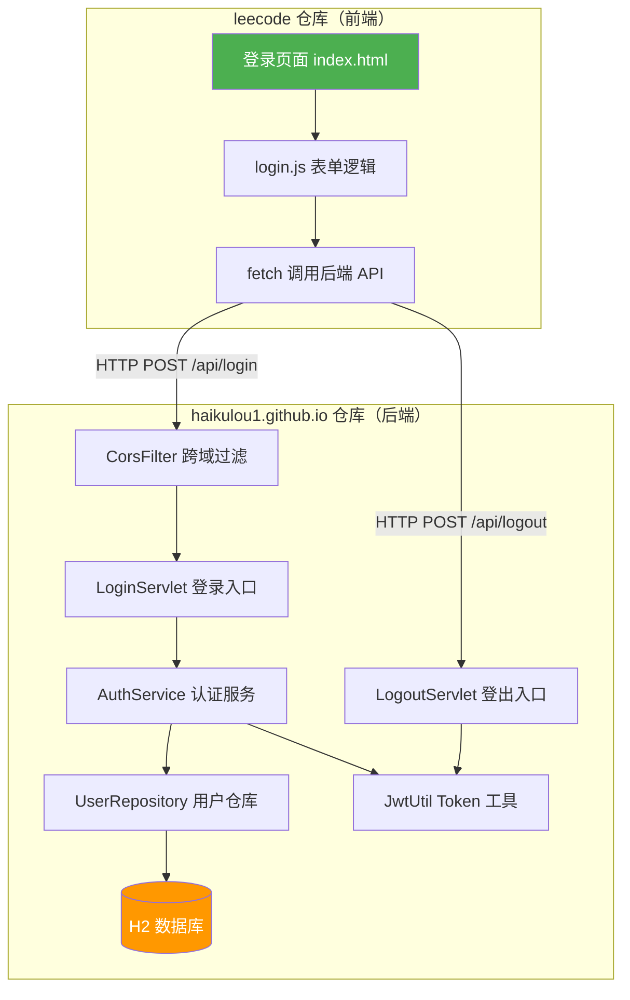
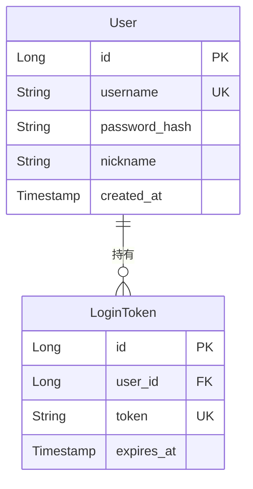
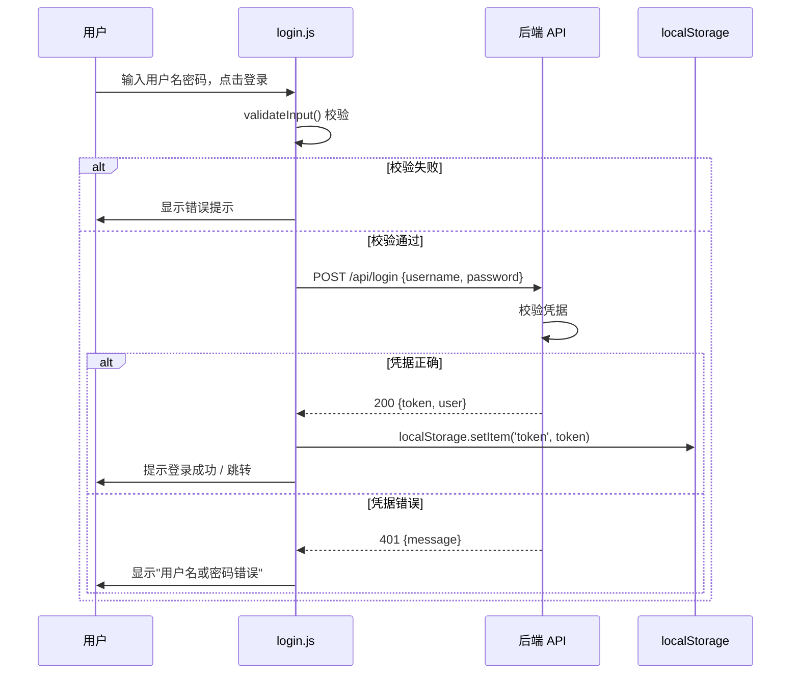
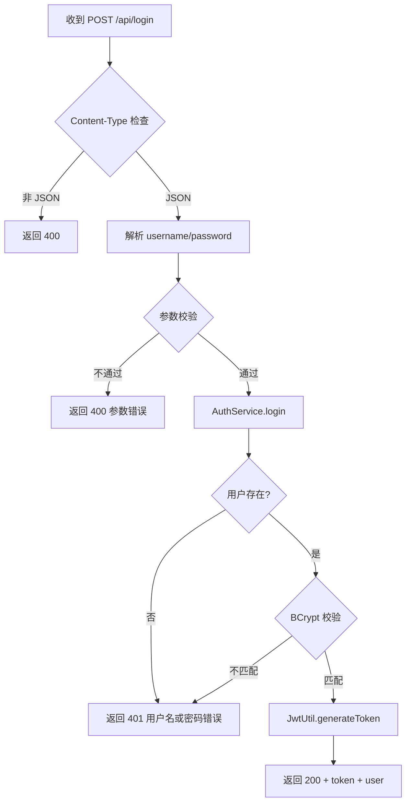

# 系统分析设计文档：用户登录功能

> **文档元信息**
>
> | 项目 | 值 |
> |------|-----|
> | 文档主题 | 用户登录功能（前端放 leecode / 后端放 haikulou） |
> | 设计模式 | 全量模式（无同模块历史文档，首次设计） |
> | 产出文件 | `.agents/20260729-写登录需求前端放leetcode后端放haikulou/design.md` |
> | 落盘仓库 | haikulou1.github.io |
> | 创建日期 | 2026-07-29 |
> | 流程实例ID | 20260729-a7k |
> | 使用技能 | dtazziboot-system-analysis-design |

---

## Step 0: 项目初始信息

### 0.1 跨仓工作区现状

| 仓库 | 物理路径 | 现有技术栈 | 需求分配 |
|------|---------|-----------|---------|
| **haikulou1.github.io** | `…/worktree/haikulou1.github.io-master` | Hexo 3.9.0 静态博客（NexT 7.4.0 主题），纯 HTML/CSS/JS，集成 Valine 评论系统（LeanCloud 无后端），本地搜索 + Algolia 搜索 | **后端代码** |
| **leecode** | `…/worktree/leecode-master` | Java Maven 项目：`designmodel` 模块（groupId: `cn.wy`，含 `javax.servlet-api 3.1.0`、JUnit 4.11、TestNG 7.0.0-beta3，Java 1.7 编译目标）；`leecode` 模块（IntelliJ IDEA 工程，LeetCode 刷题源码） | **前端代码** |

### 0.2 SSOT 检测

- 两仓库均无 `SSOT.md`，使用默认配置。
- 无 `docs/ARCHITECTURE.md`、无 `docs/modules/`、无 `docs/changes/` 历史系分文档。
- 判定：**全量模式**（首次设计，无增量基线）。

### 0.3 现状与需求分配的错位分析

需求要求「前端代码放在 leecode，后端代码放在 haikulou」，但两仓库现状与该分配存在技术栈错位：

| 仓库 | 现有性质 | 需求分配 | 错位程度 |
|------|---------|---------|---------|
| haikulou1.github.io | 静态前端博客站（GitHub Pages 托管） | 后端代码 | 高——静态站无服务端运行时 |
| leecode | Java 后端项目（Maven + Servlet） | 前端代码 | 中——Java 项目可附带静态资源 |

**自主假设与决策**（技能要求：遇到需求歧义时自主给出合理假设，不暂停）：

尊重用户明确的仓库分配意图，在两仓库中**新增独立子目录**承载目标代码，不改动现有代码结构：

- **haikulou1.github.io** → 新增 `server/` 目录，承载后端登录服务（Java Servlet，复用 leecode `designmodel` 模块的 servlet-api 经验，保持技术栈一致性）。
- **leecode** → 新增 `web/login/` 目录，承载前端登录页面（HTML/CSS/JS，纯静态，可通过浏览器直接打开或由后端静态资源服务托管）。

### 0.4 关键词检索

从需求中提炼关键词：`用户登录`、`认证鉴权`、`跨仓接口契约`。无 `board-knowledge-search` skill 可用，基于仓库现状事实进行设计。

---

## Step 1: 需求与范围分析

### 1.1 需求描述

> 写一个登录需求，前端代码放在 leecode，后端代码放在 haikulou。

### 1.2 需求拆解

| 编号 | 需求项 | 说明 | 优先级 |
|------|--------|------|--------|
| R-01 | 用户登录页面 | 前端提供用户名/密码输入表单，提交至后端 | P0 |
| R-02 | 登录认证接口 | 后端接收凭据，校验，返回认证结果 | P0 |
| R-03 | 登录状态保持 | 登录成功后维持会话（Token/Session） | P0 |
| R-04 | 登录失败提示 | 凭据错误时前端展示友好提示 | P0 |
| R-05 | 登出功能 | 清除登录状态 | P1 |
| R-06 | 密码安全存储 | 后端密码不可明文存储 | P0 |

### 1.3 范围边界

**本次包含（In Scope）：**
- 用户名 + 密码方式的登录认证
- 前端登录页面（HTML/CSS/JS）
- 后端登录认证 Servlet 接口
- 密码哈希存储（BCrypt）
- 基于 Token 的会话保持
- 基础输入校验与错误提示

**本次不包含（Out of Scope）：**
- 用户注册功能（后续迭代）
- 第三方 OAuth 登录（GitHub/Google 等）
- 短信/邮箱验证码登录
- 密码找回/重置流程
- 多因素认证（MFA）
- 用户权限管理（RBAC）
- 界面美化为产品级（保持功能可用即可）

### 1.4 用户故事

```
作为访客，我希望能够通过用户名和密码登录，
以便获取个性化内容访问权限。
```

### 1.5 验收标准

| AC编号 | 验收条件 |
|--------|---------|
| AC-01 | 访问登录页面，能看到用户名、密码输入框和登录按钮 |
| AC-02 | 输入正确凭据，点击登录，跳转/提示登录成功 |
| AC-03 | 输入错误凭据，点击登录，显示"用户名或密码错误" |
| AC-04 | 用户名或密码为空时，前端拦截，不发请求 |
| AC-05 | 密码在数据库中以 BCrypt 哈希存储，非明文 |
| AC-06 | 登录成功返回 Token，后续请求携带 Token 可识别身份 |
| AC-07 | 登出后 Token 失效，再次访问受保护资源被拒 |

---

## Step 2: 架构与模块划分

### 2.1 总体架构

```
┌─────────────────────────────────────────────────────┐
│                     用户浏览器                        │
│              (访问登录页 / 提交表单)                    │
└──────────┬──────────────────────────┬────────────────┘
           │                          │
           │ HTTP (跨仓调用)            │
           ▼                          ▼
┌──────────────────┐        ┌──────────────────────────┐
│  leecode 仓库     │        │  haikulou1.github.io 仓库  │
│  (前端)           │        │  (后端)                    │
│                  │  ────▶ │                           │
│  web/login/      │  HTTP  │  server/                  │
│  ├── index.html  │  POST  │  ├── LoginServlet.java   │
│  ├── login.css   │  /api/ │  ├── LogoutServlet.java  │
│  └── login.js    │  login │  ├── AuthService.java     │
│                  │        │  ├── UserRepository.java  │
│                  │        │  ├── JwtUtil.java         │
│                  │        │  └── User.java (实体)      │
│                  │        │                           │
│                  │        │  server/WEB-INF/web.xml   │
│                  │        │  server/pom.xml           │
└──────────────────┘        └──────────────────────────┘
                                       │
                                       ▼
                            ┌──────────────────┐
                            │   数据存储层       │
                            │  (H2 内存数据库    │
                            │   / MySQL 可切换)  │
                            └──────────────────┘
```

### 2.2 跨仓部署拓扑

| 仓库 | 角色 | 部署形态 | 运行端口（开发） |
|------|------|---------|----------------|
| leecode | 前端 | 静态 HTML/JS，浏览器直接打开或通过简易 HTTP 服务器 | — |
| haikulou1.github.io | 后端 | Java Servlet 应用，运行于 Servlet 容器（Tomcat） | `localhost:8080` |

### 2.3 跨库接口契约（向后兼容原则）

前后端通过 HTTP RESTful API 通信，契约如下：

**接口形式**：RESTful JSON（符合技能约定：对外接口默认 OpenAPI）

| 契约项 | 约定值 |
|--------|--------|
| 基础路径 | `/api` |
| 数据格式 | `application/json; charset=UTF-8` |
| 认证方式 | `Authorization: Bearer <JWT Token>` |
| 跨域策略 | 后端 CORS 允许前端源（开发期 `*`，生产期配置白名单） |
| 时间格式 | ISO 8601 UTC（`yyyy-MM-dd'T'HH:mm:ss'Z'`） |

### 2.4 模块划分

#### 前端模块（leecode 仓库）

| 模块 | 路径 | 职责 |
|------|------|------|
| 登录视图 | `web/login/index.html` | 登录页面 DOM 结构 |
| 登录样式 | `web/login/login.css` | 表单样式 |
| 登录逻辑 | `web/login/login.js` | 表单校验、请求发送、Token 存储、页面跳转 |

#### 后端模块（haikulou1.github.io 仓库）

| 模块 | 路径 | 职责 |
|------|------|------|
| 登录入口 | `server/src/main/java/cn/haikulou/auth/LoginServlet.java` | 接收登录请求，调用认证服务，返回 Token |
| 登出入口 | `server/src/main/java/cn/haikulou/auth/LogoutServlet.java` | 失效 Token |
| 认证服务 | `server/src/main/java/cn/haikulou/auth/AuthService.java` | 密码校验、Token 生成与验证 |
| 用户仓库 | `server/src/main/java/cn/haikulou/auth/UserRepository.java` | 用户数据持久化（查询、初始化默认用户） |
| JWT 工具 | `server/src/main/java/cn/haikulou/auth/JwtUtil.java` | JWT 签发与解析 |
| 用户实体 | `server/src/main/java/cn/haikulou/auth/User.java` | 用户数据模型 |
| 统一响应 | `server/src/main/java/cn/haikulou/auth/ApiResponse.java` | 标准化 JSON 响应封装 |
| CORS 过滤器 | `server/src/main/java/cn/haikulou/auth/CorsFilter.java` | 跨域请求处理 |
| 部署描述 | `server/src/main/webapp/WEB-INF/web.xml` | Servlet 路由映射 |
| 构建配置 | `server/pom.xml` | Maven 依赖与编译配置 |

### 2.5 架构设计图（Mermaid）



---

## Step 3: 数据模型与存储

### 3.1 实体清单

| 实体名 | 说明 | 所属模块 | 关系 |
|--------|------|---------|------|
| User | 用户账号实体，存储登录凭据 | 后端 / auth | 独立实体 |
| LoginToken | 登录令牌实体（可选，JWT 无状态模式下可省略持久化） | 后端 / auth | 属于 User（1:N，一个用户可有多个有效 Token） |

### 3.2 存储方案选型

| 方案 | 说明 | 优点 | 缺点 | 决策 |
|------|------|------|------|------|
| H2 内存数据库 | 内嵌数据库，随应用启停 | 零配置、开发友好 | 重启数据丢失 | ✅ 推荐方案（MVP 阶段） |
| MySQL | 外部关系型数据库 | 持久化、生产可用 | 需额外部署 | 后续迭代引入 |
| SQLite | 文件级嵌入式数据库 | 持久化、零配置 | 并发受限 | 备选方案 |

**决策**：MVP 阶段使用 H2 内存数据库，初始化时写入默认测试用户，保证开箱即用。数据访问层抽象接口，后续可无缝切换至 MySQL。

### 3.3 实体关系图（Mermaid erDiagram）



> **注**：JWT 无状态模式下，LoginToken 持久化为可选（用于强制登出/黑名单场景）。MVP 阶段采用无状态 JWT，不持久化 Token，仅持久化 User 实体。

### 3.4 缓存/MQ

- 本次无缓存需求（MVP 规模小，直接查库）。
- 本次无 MQ 需求。

### 3.5 租户隔离

- 本功能为博客单租户场景，不引入 `tenant_id`。

### 3.6 命名规范

- 表名：小写下划线 `user`、`login_token`
- 字段名：小写下划线 `password_hash`、`created_at`
- Java 实体：大驼峰 `User`、`LoginToken`

---

## Step 4: 接口设计

### 4.1 接口总览

| 编号 | 接口名称 | 方法 | 路径 | 所属模块 | 类型 |
|------|---------|------|------|---------|------|
| API-01 | 用户登录 | POST | `/api/login` | 后端/auth | OpenAPI |
| API-02 | 用户登出 | POST | `/api/logout` | 后端/auth | OpenAPI |
| API-03 | 获取当前用户信息 | GET | `/api/user/current` | 后端/auth | OpenAPI |
| API-04 | 前端登录页面 | GET | `web/login/index.html` | 前端 | 静态资源 |

### 4.2 接口详细定义

#### API-01: 用户登录

```
POST /api/login
Content-Type: application/json
```

**请求体（Request Body）**：

| 字段 | 类型 | 必填 | 校验规则 | 说明 |
|------|------|------|---------|------|
| username | String | 是 | 长度 3-32，字母数字下划线 | 用户名 |
| password | String | 是 | 长度 6-64 | 密码（明文传输，HTTPS 下安全） |

请求示例：
```json
{
  "username": "admin",
  "password": "123456"
}
```

**响应（Response）**：

成功（HTTP 200）：
```json
{
  "code": 0,
  "message": "success",
  "data": {
    "token": "eyJhbGciOiJIUzI1NiJ9...",
    "expiresIn": 86400,
    "user": {
      "id": 1,
      "username": "admin",
      "nickname": "管理员"
    }
  }
}
```

失败（HTTP 401）：
```json
{
  "code": 40101,
  "message": "用户名或密码错误",
  "data": null
}
```

参数校验失败（HTTP 400）：
```json
{
  "code": 40001,
  "message": "用户名和密码不能为空",
  "data": null
}
```

#### API-02: 用户登出

```
POST /api/logout
Authorization: Bearer <token>
```

**请求体**：无

**响应**：

成功（HTTP 200）：
```json
{
  "code": 0,
  "message": "success",
  "data": null
}
```

#### API-03: 获取当前用户信息

```
GET /api/user/current
Authorization: Bearer <token>
```

**响应**：

成功（HTTP 200）：
```json
{
  "code": 0,
  "message": "success",
  "data": {
    "id": 1,
    "username": "admin",
    "nickname": "管理员"
  }
}
```

未认证（HTTP 401）：
```json
{
  "code": 40100,
  "message": "未登录或登录已过期",
  "data": null
}
```

### 4.3 错误码表

| 错误码 | HTTP Status | 说明 |
|--------|-------------|------|
| 0 | 200 | 成功 |
| 40001 | 400 | 参数校验失败 |
| 40100 | 401 | 未登录或 Token 过期 |
| 40101 | 401 | 用户名或密码错误 |
| 50000 | 500 | 服务器内部错误 |

### 4.4 跨域配置

后端 `CorsFilter` 统一处理 CORS：

| 响应头 | 值 |
|--------|-----|
| `Access-Control-Allow-Origin` | 开发期 `*`；生产期前端域名白名单 |
| `Access-Control-Allow-Methods` | `GET, POST, OPTIONS` |
| `Access-Control-Allow-Headers` | `Content-Type, Authorization` |
| `Access-Control-Allow-Credentials` | `true` |

OPTIONS 预检请求直接返回 204。

---

## Step 5: 功能模块设计

### 5.1 前端模块（leecode 仓库）

#### 5.1.1 登录页面 `web/login/index.html`

**职责**：提供登录表单 DOM 结构。

**核心元素**：
- 用户名输入框 `<input type="text" id="username">`
- 密码输入框 `<input type="password" id="password">`
- 登录按钮 `<button id="loginBtn">登录</button>`
- 错误提示区域 `<div id="errorMsg">`
- 加载状态指示器

**交互逻辑**：
- 点击登录按钮 → 调用 `login.js` 的 `handleLogin()`
- 回车键提交 → 绑定 `keypress` 事件

#### 5.1.2 登录样式 `web/login/login.css`

**职责**：居中卡片式登录表单样式，响应式适配。

#### 5.1.3 登录逻辑 `web/login/login.js`

**核心函数**：

| 函数 | 职责 |
|------|------|
| `handleLogin()` | 获取输入值 → 前端校验 → 调用 `sendLoginRequest()` |
| `validateInput(username, password)` | 非空校验、长度校验 |
| `sendLoginRequest(username, password)` | fetch POST `/api/login`，解析响应 |
| `onLoginSuccess(token, user)` | 存储 Token 到 localStorage，跳转首页或提示成功 |
| `onLoginError(message)` | 展示错误信息 |
| `getToken()` | 从 localStorage 读取 Token |
| `logout()` | 调用 `/api/logout`，清除本地 Token |

**API 基地址配置**：
```javascript
const API_BASE = 'http://localhost:8080'; // 后端服务地址
```

**Token 存储策略**：`localStorage`（MVP 阶段简单方案，后续可改为 HttpOnly Cookie）

**核心流程**：



### 5.2 后端模块（haikulou1.github.io 仓库）

#### 5.2.1 用户实体 `User.java`

| 字名 | Java类型 | DB字段 | 说明 |
|------|---------|--------|------|
| id | Long | id | 主键，自增 |
| username | String | username | 用户名，唯一索引 |
| passwordHash | String | password_hash | BCrypt 哈希 |
| nickname | String | nickname | 昵称，展示用 |
| createdAt | Timestamp | created_at | 创建时间 |

#### 5.2.2 认证服务 `AuthService.java`

| 方法签名 | 职责 |
|---------|------|
| `LoginResult login(String username, String password)` | 查询用户 → BCrypt 校验密码 → 生成 JWT |
| `boolean verifyToken(String token)` | 解析并验证 JWT 有效性 |
| `User getCurrentUser(String token)` | 从 Token 提取用户 ID → 查询用户信息 |
| `void logout(String token)` | MVP 无状态模式：客户端清除即可（预留黑名单接口） |

**密码校验流程**：
```
输入 password → BCrypt.checkpw(password, user.passwordHash)
  → true: 生成 JWT（含 userId, username, 过期时间）
  → false: 返回认证失败
```

#### 5.2.3 JWT 工具 `JwtUtil.java`

| 配置项 | 值 |
|--------|-----|
| 算法 | HS256 |
| Secret | 从环境变量 `JWT_SECRET` 读取，默认值（仅开发）`haikulou-dev-secret-key` |
| 有效期 | 24 小时（86400 秒） |
| Claims | `userId`, `username`, `exp` |

| 方法 | 职责 |
|------|------|
| `String generateToken(Long userId, String username)` | 签发 JWT |
| `Claims parseToken(String token)` | 解析 JWT，无效抛异常 |
| `boolean isExpired(String token)` | 判断是否过期 |

#### 5.2.4 用户仓库 `UserRepository.java`

| 方法 | 职责 |
|------|------|
| `User findByUsername(String username)` | 按用户名查询 |
| `void initDefaultUser()` | 初始化默认用户（admin/BCrypt("123456")） |

**数据源配置**：
- H2 内存模式，JDBC URL: `jdbc:h2:mem:authdb`
- 建表 DDL 内嵌于 `UserRepository` 静态初始化块

#### 5.2.5 统一响应 `ApiResponse.java`

```java
public class ApiResponse<T> {
    private int code;
    private String message;
    private T data;
    // 工厂方法
    public static <T> ApiResponse<T> success(T data) { ... }
    public static <T> ApiResponse<T> error(int code, String message) { ... }
}
```

#### 5.2.6 LoginServlet 处理流程



#### 5.2.7 构建配置 `server/pom.xml`

| 依赖 | groupId:artifactId | 版本 | 用途 |
|------|-------------------|------|------|
| Servlet API | javax.servlet:javax.servlet-api | 3.1.0 | Servlet 运行时（provided） |
| JSON 处理 | com.google.code.gson:gson | 2.10.1 | JSON 序列化/反序列化 |
| BCrypt | org.mindrot:jbcrypt | 0.4 | 密码哈希 |
| JWT | io.jsonwebtoken:jjwt | 0.9.1 | JWT 签发与解析 |
| H2 数据库 | com.h2database:h2 | 2.2.224 | 内嵌数据库 |
| JUnit | junit:junit | 4.13.2 | 单元测试（test） |

> 编译目标：Java 8（兼容 servlet-api 3.1.0 + jjwt 0.9.1）

---

## Step 6: 非功能性需求设计

### 6.1 安全性

| 安全项 | 措施 | 优先级 |
|--------|------|--------|
| 密码存储 | BCrypt 哈希（salt rounds=10），禁止明文 | P0 |
| 传输安全 | 生产环境强制 HTTPS（由反向代理/CDN 终结 TLS） | P1 |
| XSS 防护 | 前端错误提示使用 `textContent` 而非 `innerHTML` | P0 |
| CSRF 防护 | MVP 使用 Token 模式（非 Cookie），天然免疫 CSRF | P0 |
| 暴力破解 | 预留接口：同 IP 同用户连续失败 5 次锁定 15 分钟（MVP 暂不实现，标注 TODO） | P2 |
| JWT Secret | 环境变量注入，禁止硬编码到代码仓库 | P0 |
| SQL 注入 | 使用参数化查询（PreparedStatement） | P0 |

### 6.2 性能

| 指标 | 目标 | 说明 |
|------|------|------|
| 登录接口响应时间 | P99 < 200ms | H2 内存库 + BCrypt（约 50ms） |
| 并发登录 | 支持 50 QPS | MVP 单实例足够 |
| Token 验证 | < 5ms | JWT 本地解析，无 IO |

### 6.3 可用性

| 项目 | 措施 |
|------|------|
| 错误提示 | 用户友好文案，不暴露系统内部信息（如"用户名或密码错误"而非"用户不存在"） |
| 加载状态 | 前端登录按钮点击后禁用 + loading 动画，防止重复提交 |
| 回车提交 | 支持键盘 Enter 键提交表单 |

### 6.4 可维护性

| 项目 | 措施 |
|------|------|
| 配置外置 | API 基地址、JWT Secret 等通过环境变量/配置文件注入 |
| 分层清晰 | Servlet（接入）→ Service（业务）→ Repository（数据）三层分离 |
| 日志 | 关键操作记录日志（登录成功/失败），不记录密码明文 |

### 6.5 兼容性

| 项目 | 说明 |
|------|------|
| 浏览器兼容 | Chrome 90+, Firefox 88+, Safari 14+, Edge 90+ |
| Java 版本 | JDK 8+ |
| Servlet 容器 | Tomcat 8.5+ / Jetty 9.4+ |

---

## Step 7: 变更三板斧设计

### 7.1 灰度策略

| 项目 | 说明 |
|------|------|
| 灰度方式 | MVP 阶段无线上流量，直接全量上线 |
| 回滚方式 | Git 回退 + 重新部署（后端 Servlet 应用重启即可） |
| 数据迁移 | H2 内存库无持久数据，无需迁移回滚 |

### 7.2 兼容性保障

| 变更点 | 兼容策略 |
|--------|---------|
| 新增 API | 全新接口，无历史调用方，无兼容负担 |
| 前端新增页面 | 新增独立目录 `web/login/`，不改动 leecode 现有代码 |
| 后端新增服务 | 新增独立目录 `server/`，不改动 haikulou 现有博客代码 |
| 跨仓契约 | 接口路径 `/api/login` 等为新增，向后兼容（仅新增，不修改） |

### 7.3 监控告警

| 监控项 | 方式 | 阈值 |
|--------|------|------|
| 登录失败率 | 日志统计失败/总请求 | > 30% 告警 |
| 接口响应时间 | 日志记录耗时 | P99 > 500ms 告警 |
| 服务可用性 | 健康检查端点 `/api/health` | 连续 3 次失败告警 |

> MVP 阶段以日志为主，后续接入 Prometheus + Grafana。

---

## 决策记录

| 决策项 | 决策结果 | 备选方案 | 决策原因 |
|--------|---------|---------|---------|
| 后端技术栈 | Java Servlet（war 包 + Tomcat） | Node.js Express / Python Flask | leecode 的 designmodel 模块已有 servlet-api 依赖和 Maven 构建经验，团队 Java 技术栈一致；保持后端技术栈统一 |
| 数据库 | H2 内存数据库 | MySQL / SQLite | MVP 阶段零配置开箱即用，数据访问层抽象后可切换 MySQL |
| 会话保持 | JWT 无状态 Token | Session + Cookie | 前后端跨域场景下 Token 更简单，天然防 CSRF，无服务端存储负担 |
| 密码哈希 | BCrypt（salt rounds=10） | MD5+Salt / SHA-256 | BCrypt 自带盐值，抗彩虹表，业界标准 |
| 前端技术栈 | 原生 HTML/CSS/JS | Vue / React | 登录页功能简单，引入框架过重；原生 JS + fetch 足够，与 haikulou 博客纯前端风格一致 |
| Token 存储 | localStorage | HttpOnly Cookie / sessionStorage | localStorage 跨标签页共享、持久化；HttpOnly Cookie 更安全但需后端配合，MVP 阶段简化 |
| 仓库分配 | 尊重用户分配（前端→leecode，后端→haikulou） | 按技术栈自然分配（前端→haikulou，后端→leecode） | 用户明确要求，设计阶段遵从需求；通过新增独立子目录隔离，不影响现有代码 |
| 产物落盘仓库 | haikulou1.github.io | leecode | 系分设计文档为跨仓整体设计产物，落盘到后端核心业务仓库，符合优先级规则 |
| 文档设计模式 | 全量模式 | 增量模式 | 无同模块历史系分文档，首次设计 |

---

## Step 9: 方案检查

### 9.1 跨仓对齐点检查

| 检查项 | 检查结果 | 状态 |
|--------|---------|------|
| 前端请求路径 `/api/login` ↔ 后端 Servlet 映射 `/api/login` | 一致 | ✅ |
| 前端请求体字段 `{username, password}` ↔ 后端解析字段 | 类型一致（String/String） | ✅ |
| 前端响应解析 `data.token` ↔ 后端返回 `data.token` | 字段名一致 | ✅ |
| 前端响应解析 `data.user.username` ↔ 后端返回 `data.user.username` | 字段名一致 | ✅ |
| 前端 `API_BASE` 配置 ↔ 后端运行端口 `localhost:8080` | 一致 | ✅ |
| 前端 fetch Content-Type `application/json` ↔ 后端解析 JSON | 一致 | ✅ |
| 前端 `Authorization: Bearer <token>` ↔ 后端 Token 解析 | 一致 | ✅ |
| CORS 配置允许前端源 ↔ 前端实际请求源 | 开发期 `*` 全允许 | ✅ |
| 错误码 `40101` 前端展示逻辑 ↔ 后端返回 | 一致 | ✅ |

### 9.2 风险检查

| 风险项 | 等级 | 缓解措施 |
|--------|------|---------|
| haikulou 为 GitHub Pages 静态站，后端 Servlet 无法直接部署到 Pages | 中 | 后端独立部署到支持 Java 的服务器/云平台，GitHub Pages 仅托管前端博客；或使用 Cloudflare Workers 改写后端 |
| JWT Secret 硬编码风险 | 高 | 强制环境变量注入，代码中仅读环境变量，提供默认值仅限开发 |
| 密码明文传输（HTTP） | 中 | 生产环境强制 HTTPS；MVP 开发期可接受 |
| H2 内存库重启丢数据 | 低 | MVP 阶段可接受；生产切换 MySQL |
| localStorage Token 被 XSS 窃取 | 中 | 前端 XSS 防护（textContent）；后续迭代迁移至 HttpOnly Cookie |

### 9.3 遗留事项（TODO）

| TODO | 说明 | 优先级 |
|------|------|--------|
| 暴力破解防护 | 同 IP/用户连续失败锁定 | P2 |
| 注册功能 | 用户注册页面与接口 | P1 |
| HTTPS 强制 | 生产环境 TLS 配置 | P1 |
| MySQL 切换 | 数据源配置切换 + 建表 DDL | P1 |
| HttpOnly Cookie | Token 存储方式升级 | P2 |
| 监控接入 | Prometheus + Grafana | P2 |

---

## 附录

### A. 跨仓文件清单

| 仓库 | 文件路径（逻辑前缀） | 类型 |
|------|---------------------|------|
| [leecode] | `web/login/index.html` | 前端-新增 |
| [leecode] | `web/login/login.css` | 前端-新增 |
| [leecode] | `web/login/login.js` | 前端-新增 |
| [haikulou1.github.io] | `server/pom.xml` | 后端-新增 |
| [haikulou1.github.io] | `server/src/main/java/cn/haikulou/auth/User.java` | 后端-新增 |
| [haikulou1.github.io] | `server/src/main/java/cn/haikulou/auth/ApiResponse.java` | 后端-新增 |
| [haikulou1.github.io] | `server/src/main/java/cn/haikulou/auth/AuthService.java` | 后端-新增 |
| [haikulou1.github.io] | `server/src/main/java/cn/haikulou/auth/UserRepository.java` | 后端-新增 |
| [haikulou1.github.io] | `server/src/main/java/cn/haikulou/auth/JwtUtil.java` | 后端-新增 |
| [haikulou1.github.io] | `server/src/main/java/cn/haikulou/auth/LoginServlet.java` | 后端-新增 |
| [haikulou1.github.io] | `server/src/main/java/cn/haikulou/auth/LogoutServlet.java` | 后端-新增 |
| [haikulou1.github.io] | `server/src/main/java/cn/haikulou/auth/CorsFilter.java` | 后端-新增 |
| [haikulou1.github.io] | `server/src/main/java/cn/haikulou/auth/CurrentUserServlet.java` | 后端-新增 |
| [haikulou1.github.io] | `server/src/main/webapp/WEB-INF/web.xml` | 后端-新增 |

### B. 默认测试用户

| 用户名 | 密码 | 昵称 |
|--------|------|------|
| admin | 123456 | 管理员 |

> 密码以 BCrypt 哈希存储，初始化时写入 H2 数据库。
