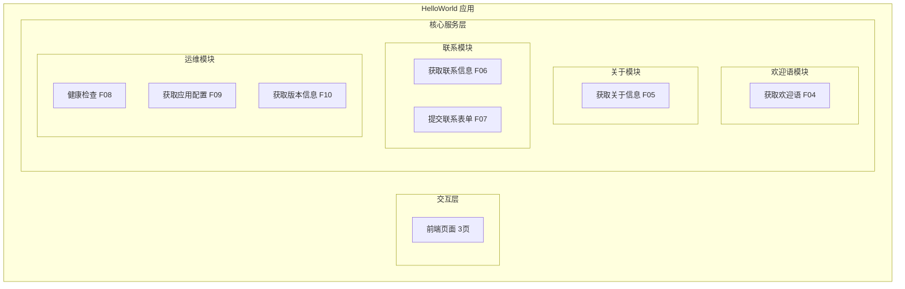
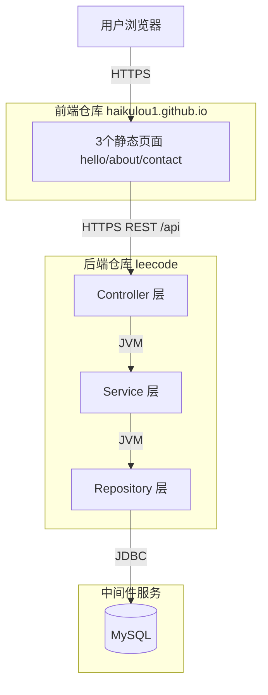
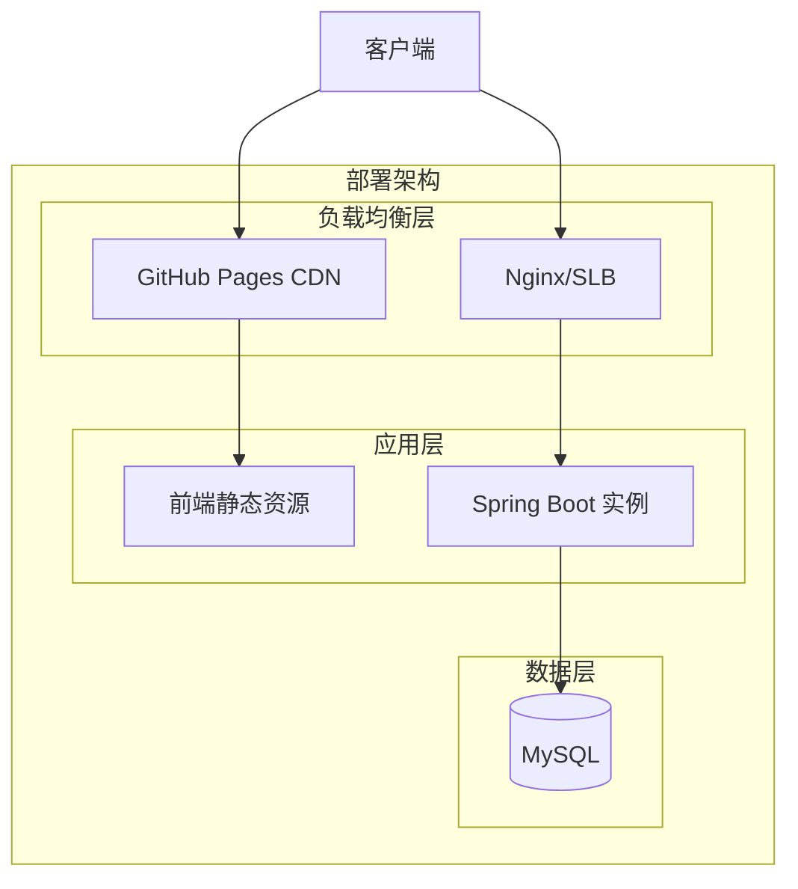
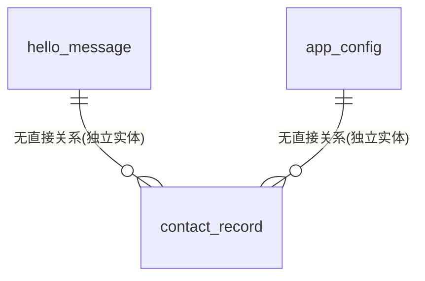
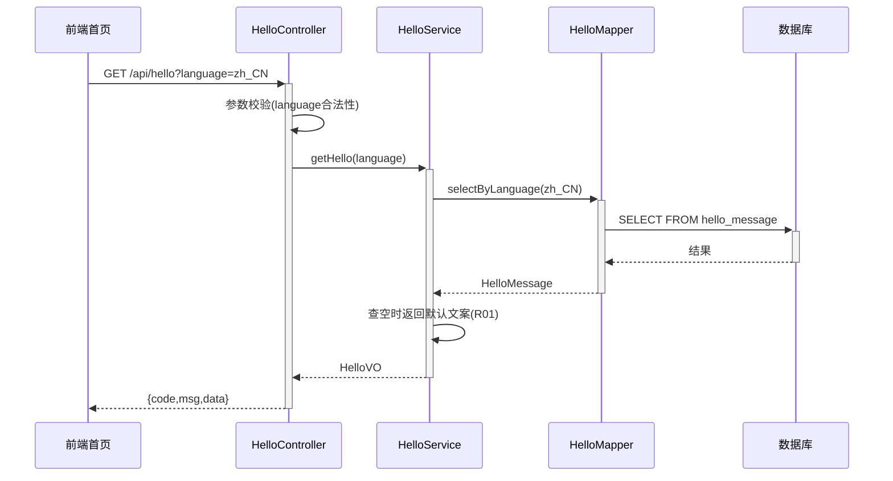
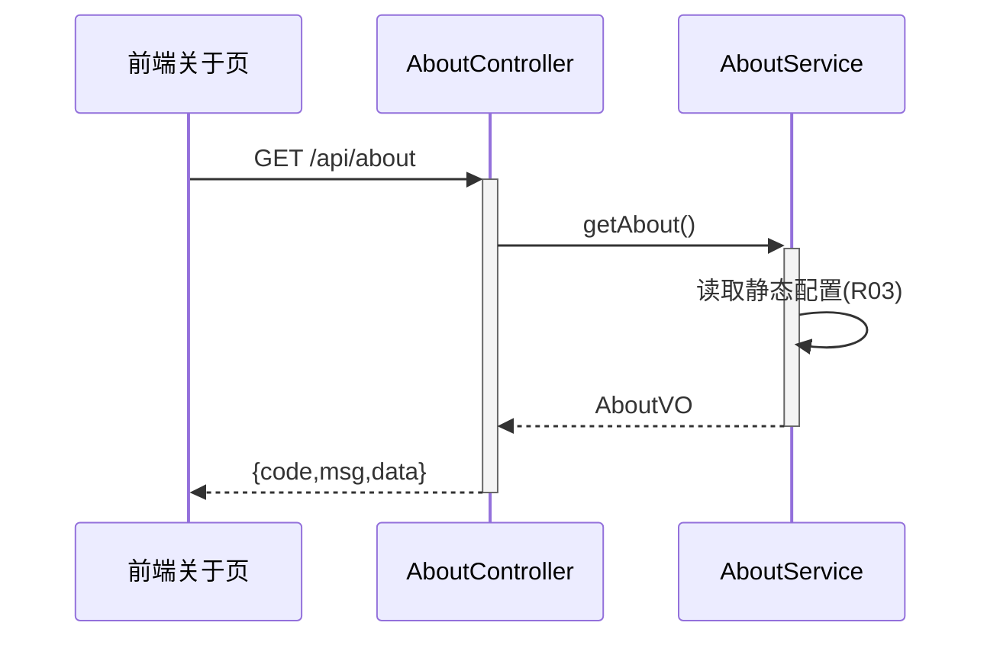
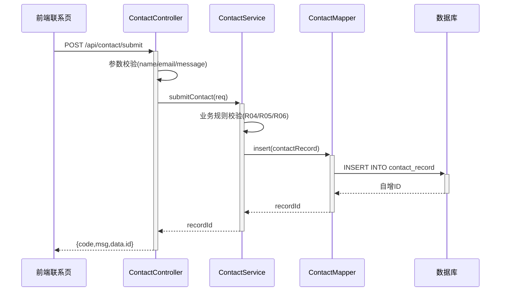
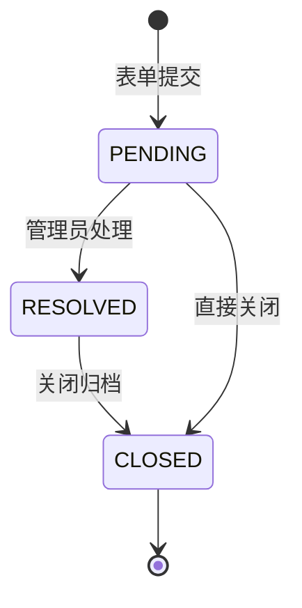
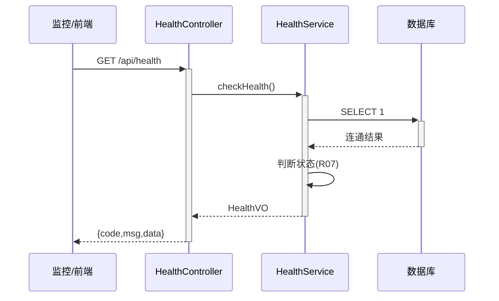

> **文档元信息**
>
> | 项目 | 内容 |
> |------|------|
> | 文档版本 | v1.0 |
> | 作者 | DTCoder（AI 系分设计） |
> | 创建日期 | 2026-07-30 |
> | 需求来源 | 任务输入：写一个 helloworld，前端需要 3 个页面，后端需要 7 个 |
> | 评审状态 | 待评审 |

# HelloWorld 前后端页面 系分设计

## 1. 需求与范围

- **背景与目标**：构建一个前后端分离的 HelloWorld 示例应用。前端提供 3 个页面用于展示与交互，后端提供 7 个 REST 接口支撑前端数据与基础运维能力。目标是验证跨仓库（前端 [haikulou1.github.io] + 后端 [leecode]）协同开发链路，打通前后端接口契约。
- **核心功能**：
  - 前端 3 个页面：HelloWorld 首页、关于页面、联系页面。
  - 后端 7 个接口：获取欢迎语、获取关于信息、获取联系信息、提交联系表单、健康检查、获取应用配置、获取版本信息。
- **约束与非功能要求**：
  - 前端为静态 HTML 页面，部署于 GitHub Pages，无构建工具依赖。
  - 后端为 Java Spring Boot 单体应用，RESTful JSON 接口。
  - 通用出参结构 `{code, msg, data}`，向后兼容。
  - 接口响应时间 < 200ms（不含网络）。
- **排除范围**：
  - 不涉及用户认证/授权体系（Demo 应用）。
  - 不涉及分布式/微服务拆分。
  - 不涉及消息队列、缓存中间件。

### 需求功能清单与优先级

| 编号 | 功能点 | 优先级 | PRD 原始描述/章节 | 备注 |
|------|--------|--------|-------------------|------|
| F01 | 前端-HelloWorld 首页 | P0 | "前端需要3个页面" → 首页 | 展示欢迎语，调用后端 GET /api/hello |
| F02 | 前端-关于页面 | P0 | "前端需要3个页面" → 关于 | 展示关于信息，调用后端 GET /api/about |
| F03 | 前端-联系页面 | P0 | "前端需要3个页面" → 联系 | 展示联系信息 + 表单，调用 GET /api/contact + POST /api/contact/submit |
| F04 | 后端-获取欢迎语 | P0 | "后端需要7个" → 接口1 | GET /api/hello，返回欢迎语 |
| F05 | 后端-获取关于信息 | P0 | "后端需要7个" → 接口2 | GET /api/about，返回关于内容 |
| F06 | 后端-获取联系信息 | P0 | "后端需要7个" → 接口3 | GET /api/contact，返回联系方式 |
| F07 | 后端-提交联系表单 | P0 | "后端需要7个" → 接口4 | POST /api/contact/submit，持久化联系记录 |
| F08 | 后端-健康检查 | P0 | "后端需要7个" → 接口5 | GET /api/health，探活 |
| F09 | 后端-获取应用配置 | P0 | "后端需要7个" → 接口6 | GET /api/config，返回前端展示配置 |
| F10 | 后端-获取版本信息 | P0 | "后端需要7个" → 接口7 | GET /api/version，返回应用版本 |

### 假设与待确认项

| 编号 | 假设/待确认内容 | 当前假设 | 确认状态 |
|------|-----------------|----------|----------|
| A01 | 后端技术栈选型 | 假设采用 Java Spring Boot（后端仓库 [leecode] 为 Java 技术栈），原因：与仓库现有技术一致 | 待确认 |
| A02 | 前端框架选型 | 假设采用原生 HTML + JavaScript（无构建工具），原因：前端仓库为静态站点 | 待确认 |
| A03 | 后端部署地址 | 假设后端服务地址 `http://localhost:8080`，前端通过 CORS 或反向代理访问 | 待确认 |
| A04 | 数据库选型 | 假设采用 MySQL（仅联系表单需持久化），其余接口返回静态/配置数据 | 待确认 |
| A05 | 7个后端接口具体划分 | 需求未指定7个接口的具体功能，假设为：hello/about/contact/contact-submit/health/config/version | 待确认 |

## 2. 架构与模块

### 功能架构

- 交互层说明：前端 3 个 HTML 页面，通过 fetch/XHR 调用后端 REST 接口，静态部署于 GitHub Pages。
- 核心服务层说明：后端按业务域划分为 4 个模块——欢迎语模块、关于模块、联系模块、运维模块，每个模块职责单一。
- 扩展/集成层说明：本 Demo 无外部系统集成，排除。

**模块清单**

| 模块 | 职责 | 依赖 |
|------|------|------|
| 欢迎语模块 (hello) | 提供 HelloWorld 欢迎语数据 | 无 |
| 关于模块 (about) | 提供关于页面内容数据 | 无 |
| 联系模块 (contact) | 提供联系信息展示 + 接收联系表单提交并持久化 | MySQL（contact_record 表） |
| 运维模块 (ops) | 健康检查、应用配置、版本信息 | 无 |


### 应用集成架构


**集成关系说明：**

| 调用方 | 被调用方 | 协议 | 接口类型 | 说明 |
|--------|----------|------|----------|------|
| 用户浏览器 | 前端静态页面 | HTTPS | GitHub Pages 静态资源 | 浏览器加载 HTML/JS |
| 前端页面 | 后端 Controller | HTTPS | RESTful JSON | fetch/XHR 调用 /api/* |
| 后端 Service | 后端 Repository | JVM | 方法调用 | 同进程 |
| 后端 Repository | MySQL | JDBC | SQL | contact_record 表读写 |

### 部署架构


**部署说明：**
- **负载均衡层**：前端走 GitHub Pages CDN 分发静态资源；后端走 Nginx/SLB 反向代理。
- **应用层**：前端为静态文件无实例概念；后端单实例 Spring Boot（Demo 阶段，可水平扩展）。
- **数据层**：单 MySQL 实例（Demo 阶段，生产可主从）。

## 3. 数据模型与存储

### 实体清单

| 实体名称 | 实体说明 | 所属模块 | 与其他实体的关系 |
|----------|----------|----------|-----------------|
| hello_message | 欢迎语配置实体，存储首页展示的欢迎文案 | 欢迎语模块 | 无关联 |
| contact_record | 联系记录实体，存储用户通过联系表单提交的留言 | 联系模块 | 无关联（独立记录） |
| app_config | 应用配置实体，存储前端展示所需配置项 | 运维模块 | 无关联 |

### 实体关系图


**模型说明：**
- 三个实体相互独立，无外键关联。`contact_record` 为唯一需要写入的实体（表单提交），`hello_message` 和 `app_config` 为配置型数据，可由配置文件初始化。
- 本 Demo 无缓存/MQ 依赖。

## 4. 接口设计

### 4.1 oneapi（Web 控制台接口）

| 编号 | 接口名称 | 方法 | 路径 | 模块 |
|------|----------|------|------|------|
| W01 | 获取欢迎语 | GET | /api/hello | 欢迎语模块 |
| W02 | 获取关于信息 | GET | /api/about | 关于模块 |
| W03 | 获取联系信息 | GET | /api/contact | 联系模块 |
| W04 | 提交联系表单 | POST | /api/contact/submit | 联系模块 |
| W05 | 健康检查 | GET | /api/health | 运维模块 |
| W06 | 获取应用配置 | GET | /api/config | 运维模块 |
| W07 | 获取版本信息 | GET | /api/version | 运维模块 |

### 4.2 OpenAPI（对外接口）

无对外 OpenAPI 接口。本 Demo 所有接口均面向前端 oneapi 调用。

### 4.3 内部接口（Service 层）

| 编号 | 接口名称 | 类 | 方法签名 |
|------|----------|------|----------|
| S01 | 获取欢迎语 | HelloService | `HelloVO getHello()` |
| S02 | 获取关于信息 | AboutService | `AboutVO getAbout()` |
| S03 | 获取联系信息 | ContactService | `ContactVO getContact()` |
| S04 | 提交联系表单 | ContactService | `Long submitContact(ContactSubmitReq req)` |
| S05 | 健康检查 | HealthService | `HealthVO checkHealth()` |
| S06 | 获取应用配置 | ConfigService | `AppConfigVO getConfig()` |
| S07 | 获取版本信息 | VersionService | `VersionVO getVersion()` |

### 4.4 集成接口（Integration 层）

无集成接口。本 Demo 不涉及外部系统集成。

## 5. 功能模块设计

### 5.1 欢迎语模块 (hello)
#### 5.1.1 表结构设计
##### 5.1.1.1 hello_message

| 字段名 | 数据类型 | 约束 | 默认值 | 说明 |
|--------|----------|------|--------|------|
| id | bigint | PK, 自增 | - | 系统自增主键 |
| message | varchar(255) | NOT NULL | - | 欢迎语文案 |
| language | varchar(16) | NOT NULL | 'zh_CN' | 语言标识 |
| is_deleted | tinyint | NOT NULL | 0 | 是否删除：0-否 1-是 |
| gmt_create | datetime | NOT NULL | CURRENT_TIMESTAMP | 创建时间 |
| gmt_modified | datetime | NOT NULL | CURRENT_TIMESTAMP | 修改时间 |

**索引：**
- PK: `pk_hello_message` (id)
- UK: `uk_hello_message_lang` (language, is_deleted) — 按语言唯一取一条有效欢迎语

##### 5.1.1.x 枚举与常量定义

| 枚举名称 | 取值 | 含义 | 关联字段 |
|----------|------|------|----------|
| LanguageEnum | zh_CN | 简体中文 | hello_message.language |
| LanguageEnum | en_US | 英文 | hello_message.language |
| IsDeletedEnum | 0 | 未删除 | hello_message.is_deleted |
| IsDeletedEnum | 1 | 已删除 | hello_message.is_deleted |

#### 5.1.2 接口详细设计
##### W01 获取欢迎语

- **URI**: GET /api/hello
- **描述**: 返回 HelloWorld 首页展示的欢迎语文案
- **入参**:

| 参数名称 | 类型 | 是否必填 | 描述 |
|----------|------|----------|------|
| language | String | 否 | 语言标识，默认 zh_CN |

- **出参**:

| 参数名称 | 类型 | 描述 |
|----------|------|------|
| code | String | 结果code，成功为"OK" |
| msg | String | 提示信息 |
| data | Object | 业务数据 |
| data.message | String | 欢迎语文案 |
| data.language | String | 语言标识 |

- **错误码**:

| 错误码 | 说明 |
|--------|------|
| HELLO_001 | 欢迎语未配置 |
| HELLO_002 | 语言参数不合法 |

- **业务规则**: 按 language 查询未删除的欢迎语记录，未传 language 时默认 zh_CN；查不到时返回默认文案 "Hello, World!"。

- **请求示例**:
```json
GET /api/hello?language=zh_CN
```

- **响应示例**:
```json
{
  "code": "OK",
  "msg": "SUCCESS",
  "data": {
    "message": "你好，世界！",
    "language": "zh_CN"
  }
}
```

#### 5.1.3 子功能详细设计
##### 5.1.3.1 获取欢迎语（F04）

- 处理时序图


**业务规则：**
| 规则编号 | 规则描述 | 校验时机 | 不满足时的处理 |
|----------|----------|----------|--------------|
| R01 | 查询结果为空时返回默认文案 "Hello, World!" | 查询后始终 | 返回默认文案，不报错 |
| R02 | language 参数仅允许 zh_CN/en_US | 调用时 | 返回错误码 HELLO_002 |

**异常场景：**
| 异常场景 | 处理方式 |
|----------|----------|
| 数据库连接异常 | 返回默认文案 "Hello, World!"，记录错误日志 |

**并发控制（如涉及数据写入）：**
- 并发场景：仅读操作，无并发写入风险
- 控制策略：无并发风险，原因：hello_message 为配置型数据，仅初始化写入

### 5.2 关于模块 (about)
#### 5.2.1 表结构设计

本模块无独立数据表。关于信息为静态配置内容，通过 `app_config` 表或配置文件管理，避免过度建表。

##### 5.2.1.x 枚举与常量定义

本模块无枚举/常量定义。

#### 5.2.2 接口详细设计
##### W02 获取关于信息

- **URI**: GET /api/about
- **描述**: 返回关于页面的内容信息
- **入参**:

| 参数名称 | 类型 | 是否必填 | 描述 |
|----------|------|----------|------|
| 无 | - | - | 无入参 |

- **出参**:

| 参数名称 | 类型 | 描述 |
|----------|------|------|
| code | String | 结果code |
| msg | String | 提示信息 |
| data | Object | 业务数据 |
| data.title | String | 关于标题 |
| data.content | String | 关于正文内容 |
| data.author | String | 作者 |

- **错误码**:

| 错误码 | 说明 |
|--------|------|
| ABOUT_001 | 关于信息未配置 |

- **业务规则**: 返回静态配置的关于信息，含标题、正文、作者。

- **请求示例**:
```json
GET /api/about
```

- **响应示例**:
```json
{
  "code": "OK",
  "msg": "SUCCESS",
  "data": {
    "title": "关于 HelloWorld",
    "content": "这是一个前后端分离的 HelloWorld 示例应用。",
    "author": "DTCoder"
  }
}
```

#### 5.2.3 子功能详细设计
##### 5.2.3.1 获取关于信息（F05）

- 处理时序图


**业务规则：**
| 规则编号 | 规则描述 | 校验时机 | 不满足时的处理 |
|----------|----------|----------|--------------|
| R03 | 关于信息从配置文件读取，无数据库查询 | 始终 | 配置缺失时返回默认值 |

**异常场景：**
| 异常场景 | 处理方式 |
|----------|----------|
| 配置文件读取异常 | 返回默认关于信息，记录警告日志 |

**并发控制（如涉及数据写入）：**
- 并发场景：无
- 控制策略：无并发风险，原因：纯读静态配置

### 5.3 联系模块 (contact)
#### 5.3.1 表结构设计
##### 5.3.1.1 contact_record

| 字段名 | 数据类型 | 约束 | 默认值 | 说明 |
|--------|----------|------|--------|------|
| id | bigint | PK, 自增 | - | 系统自增主键 |
| name | varchar(64) | NOT NULL | - | 提交者姓名 |
| varchar(128) | NOT NULL | - | 提交者邮箱 | |
| message | varchar(512) | NOT NULL | - | 留言内容 |
| status | varchar(16) | NOT NULL | 'PENDING' | 处理状态 |
| is_deleted | tinyint | NOT NULL | 0 | 是否删除 |
| gmt_create | datetime | NOT NULL | CURRENT_TIMESTAMP | 创建时间 |
| gmt_modified | datetime | NOT NULL | CURRENT_TIMESTAMP | 修改时间 |

**索引：**
- PK: `pk_contact_record` (id)
- IDX: `idx_contact_record_status` (status) — 按状态筛选

##### 5.3.1.x 枚举与常量定义

| 枚举名称 | 取值 | 含义 | 关联字段 |
|----------|------|------|----------|
| ContactStatusEnum | PENDING | 待处理 | contact_record.status |
| ContactStatusEnum | RESOLVED | 已处理 | contact_record.status |
| ContactStatusEnum | CLOSED | 已关闭 | contact_record.status |

#### 5.3.2 接口详细设计
##### W03 获取联系信息

- **URI**: GET /api/contact
- **描述**: 返回联系页面的展示信息（邮箱、电话等）
- **入参**:

| 参数名称 | 类型 | 是否必填 | 描述 |
|----------|------|----------|------|
| 无 | - | - | 无入参 |

- **出参**:

| 参数名称 | 类型 | 描述 |
|----------|------|------|
| code | String | 结果code |
| msg | String | 提示信息 |
| data | Object | 业务数据 |
| data.email | String | 联系邮箱 |
| data.phone | String | 联系电话 |
| data.address | String | 联系地址 |

- **错误码**:

| 错误码 | 说明 |
|--------|------|
| CONTACT_001 | 联系信息未配置 |

- **业务规则**: 返回静态配置的联系信息。

- **请求示例**:
```json
GET /api/contact
```

- **响应示例**:
```json
{
  "code": "OK",
  "msg": "SUCCESS",
  "data": {
    "email": "contact@helloworld.demo",
    "phone": "123-4567-8900",
    "address": "杭州市"
  }
}
```

##### W04 提交联系表单

- **URI**: POST /api/contact/submit
- **描述**: 接收用户通过联系页面提交的表单，持久化到 contact_record 表
- **入参**:

| 参数名称 | 类型 | 是否必填 | 描述 |
|----------|------|----------|------|
| name | String | 是 | 提交者姓名，1-64字符 |
| email | String | 是 | 提交者邮箱，需符合邮箱格式 |
| message | String | 是 | 留言内容，1-512字符 |

- **出参**:

| 参数名称 | 类型 | 描述 |
|----------|------|------|
| code | String | 结果code |
| msg | String | 提示信息 |
| data | Object | 业务数据 |
| data.id | Long | 联系记录ID |

- **错误码**:

| 错误码 | 说明 |
|--------|------|
| CONTACT_002 | 姓名为空或超长 |
| CONTACT_003 | 邮箱格式不合法 |
| CONTACT_004 | 留言内容为空或超长 |

- **业务规则**: 校验入参合法性后插入 contact_record 表，初始状态 PENDING，返回自增主键 ID。

- **请求示例**:
```json
{
  "name": "张三",
  "email": "zhangsan@example.com",
  "message": "你好，我想咨询一下。"
}
```

- **响应示例**:
```json
{
  "code": "OK",
  "msg": "SUCCESS",
  "data": {
    "id": 1
  }
}
```

#### 5.3.3 子功能详细设计
##### 5.3.3.1 提交联系表单（F07）

- 处理时序图


**业务规则：**
| 规则编号 | 规则描述 | 校验时机 | 不满足时的处理 |
|----------|----------|----------|--------------|
| R04 | name 非空且 1-64 字符 | 创建时 | 返回错误码 CONTACT_002 |
| R05 | email 非空且符合邮箱正则 | 创建时 | 返回错误码 CONTACT_003 |
| R06 | message 非空且 1-512 字符 | 创建时 | 返回错误码 CONTACT_004 |

**异常场景：**
| 异常场景 | 处理方式 |
|----------|----------|
| 数据库写入失败 | 返回系统错误码 SYSTEM_ERROR，记录错误日志，事务回滚 |

**并发控制（如涉及数据写入）：**
- 并发场景：多用户同时提交联系表单
- 控制策略：无并发风险，原因：每条提交为独立记录，自增主键无冲突

**状态机设计（如实体存在状态字段）：**


**状态流转规则：**
| 当前状态 | 目标状态 | 流转条件 | 前置校验 | 触发动作 |
|----------|----------|----------|----------|----------|
| PENDING | RESOLVED | 管理员标记已处理 | 状态为PENDING | 更新gmt_modified |
| RESOLVED | CLOSED | 关闭归档 | 状态为RESOLVED | 更新gmt_modified |
| PENDING | CLOSED | 直接关闭 | 状态为PENDING | 更新gmt_modified |

### 5.4 运维模块 (ops)
#### 5.4.1 表结构设计

本模块无独立数据表。健康检查、配置、版本信息均为运行时静态/环境数据。

##### 5.4.1.x 枚举与常量定义

| 枚举名称 | 取值 | 含义 | 关联字段 |
|----------|------|------|----------|
| HealthStatusEnum | UP | 服务正常 | 接口返回 |
| HealthStatusEnum | DOWN | 服务异常 | 接口返回 |

#### 5.4.2 接口详细设计
##### W05 健康检查

- **URI**: GET /api/health
- **描述**: 探活接口，返回服务运行状态
- **入参**:

| 参数名称 | 类型 | 是否必填 | 描述 |
|----------|------|----------|------|
| 无 | - | - | 无入参 |

- **出参**:

| 参数名称 | 类型 | 描述 |
|----------|------|------|
| code | String | 结果code |
| msg | String | 提示信息 |
| data | Object | 业务数据 |
| data.status | String | 健康状态：UP/DOWN |
| data.timestamp | String | 检查时间 |

- **错误码**:

| 错误码 | 说明 |
|--------|------|
| 无 | 健康检查不返回业务错误码 |

- **业务规则**: 检查数据库连通性，连通返回 UP，否则返回 DOWN。

- **请求示例**:
```json
GET /api/health
```

- **响应示例**:
```json
{
  "code": "OK",
  "msg": "SUCCESS",
  "data": {
    "status": "UP",
    "timestamp": "2026-07-30T10:00:00"
  }
}
```

##### W06 获取应用配置

- **URI**: GET /api/config
- **描述**: 返回前端展示所需的应用级配置
- **入参**:

| 参数名称 | 类型 | 是否必填 | 描述 |
|----------|------|----------|------|
| 无 | - | - | 无入参 |

- **出参**:

| 参数名称 | 类型 | 描述 |
|----------|------|------|
| code | String | 结果code |
| msg | String | 提示信息 |
| data | Object | 业务数据 |
| data.appName | String | 应用名称 |
| data.theme | String | 主题配色 |
| data.language | String | 默认语言 |

- **错误码**:

| 错误码 | 说明 |
|--------|------|
| CONFIG_001 | 配置加载失败 |

- **业务规则**: 从配置文件读取应用配置返回。

- **请求示例**:
```json
GET /api/config
```

- **响应示例**:
```json
{
  "code": "OK",
  "msg": "SUCCESS",
  "data": {
    "appName": "HelloWorld",
    "theme": "light",
    "language": "zh_CN"
  }
}
```

##### W07 获取版本信息

- **URI**: GET /api/version
- **描述**: 返回应用版本信息
- **入参**:

| 参数名称 | 类型 | 是否必填 | 描述 |
|----------|------|----------|------|
| 无 | - | - | 无入参 |

- **出参**:

| 参数名称 | 类型 | 描述 |
|----------|------|------|
| code | String | 结果code |
| msg | String | 提示信息 |
| data | Object | 业务数据 |
| data.version | String | 版本号 |
| data.buildTime | String | 构建时间 |

- **错误码**:

| 错误码 | 说明 |
|--------|------|
| 无 | 版本信息不返回业务错误码 |

- **业务规则**: 从 Maven/Gradle 构建属性或配置文件读取版本号和构建时间。

- **请求示例**:
```json
GET /api/version
```

- **响应示例**:
```json
{
  "code": "OK",
  "msg": "SUCCESS",
  "data": {
    "version": "1.0.0",
    "buildTime": "2026-07-30T10:00:00"
  }
}
```

#### 5.4.3 子功能详细设计
##### 5.4.3.1 健康检查（F08）

- 处理时序图


**业务规则：**
| 规则编号 | 规则描述 | 校验时机 | 不满足时的处理 |
|----------|----------|----------|--------------|
| R07 | 执行 SELECT 1 探测数据库连通性 | 始终 | 连通返回 UP，异常返回 DOWN |

**异常场景：**
| 异常场景 | 处理方式 |
|----------|----------|
| 数据库连接超时 | 返回 status=DOWN，记录错误日志，HTTP 200 |

## 6. 非功能性需求设计
### 6.1 高可用性
    本 Demo 为单实例部署，不涉及多副本高可用。后端服务异常时前端页面仍可静态展示（降级为默认文案）。数据库不可用时，hello/about/contact-info 接口降级返回默认值，仅 contact-submit 接口直接报错。
### 6.2 可扩展性
    后端 Spring Boot 可水平扩缩容（无状态，contact_record 写入依赖数据库主键自增）。前端静态资源天然支持 CDN 扩展。
### 6.3 稳定性/可靠性
    边界场景：表单 message 超 512 字符时拒绝；email 格式校验兜底；language 参数非法时回退默认。空指针防护：所有 Service 返回值判空。
### 6.4 安全性设计
#### 6.4.1 账户系统方案
    本 Demo 不涉及账户系统，无登录/注册。排除范围。
#### 6.4.2 授权&访问控制
##### 6.4.2.1 是否实现水平权限检查
    不涉及。Demo 应用无用户体系，所有接口为公开数据查询。
##### 6.4.2.2 是否实现垂直权限检查
    不涉及。Demo 应用无角色体系。
##### 6.4.2.3 是否检查登录态
    不检查登录态。所有 /api/* 接口为公开访问，配置白名单放行。
#### 6.4.3 数据防护方案
##### 6.4.3.1 是否对敏感数据加密存储
    不涉及敏感数据。contact_record 中 email 为用户自愿提交的联系方式，Demo 阶段明文存储。生产环境建议加密。
##### 6.4.3.2 是否对敏感数据展示进行脱敏
    contact_record.email 在日志打印时脱敏（脱敏为 z***@example.com）。前端展示不脱敏（用户查看自己提交的信息）。
### 6.5 监控/统计/日志/告警
    关键监控点：各 /api/* 接口调用量、响应耗时、错误率。contact-submit 接口监控写入成功率。健康检查接口可作为存活探针。日志级别：ERROR（数据库异常）、WARN（降级场景）、INFO（正常调用）。

## 7. 变更三板斧
### 7.1 可监控
    各接口通过 Spring Boot Actuator + Micrometer 暴露 metrics，关键埋点：接口调用量、耗时直方图、错误计数。contact-submit 额外埋点写入成功率。健康检查接口 /api/health 可直接作为 K8s 存活探针。
### 7.2 可灰度
    Demo 阶段为全新功能首次发布，不涉及灰度（无旧逻辑并行）。后续如需灰度，可通过 Nginx 按比例引流或 Feature Flag 控制。
### 7.3 可应急
    各接口均为新增无回滚依赖。contact-submit 如出现异常可通过数据库直接清理 contact_record 表中异常数据。健康检查接口可用于快速判断服务状态。前端页面为静态资源，可随时回滚至上一版本 GitHub Pages 提交。

---

## 附：方案检查 Checklist（Step 9）

| 检查项 | 结果 | 说明 |
|--------|------|------|
| 模块划分合理性 | 通过 | 4 模块按业务域划分，职责单一，接口清晰 |
| 接口契约一致性 | 通过 | 7 接口统一 {code,msg,data} 出参，RESTful 风格 |
| 数据模型规范性 | 通过 | 表名小写下划线、整形主键、datetime 非 timestamp、无 enum 类型、含 gmt_create/gmt_modified |
| 跨仓库接口契约兼容性 | 通过 | 前端 fetch 调用后端 /api/*，出参结构向后兼容 |
| 错误码规范性 | 通过 | 格式 {MODULE}_{SEQ}，如 HELLO_001、CONTACT_002 |
| 并发控制 | 通过 | contact-submit 无并发风险（自增主键），其余为读操作 |
| 状态机完整性 | 通过 | contact_record 状态流转 PENDING→RESOLVED→CLOSED 覆盖完整 |
| 非功能覆盖 | 通过 | 高可用/扩展/稳定/安全/监控均覆盖 |
| 变更三板斧 | 通过 | 可监控/可灰度/可应急均设计 |
| 过度设计检查 | 通过 | Demo 阶段无 MQ/缓存/微服务，符合最小化原则 |
