> **文档元信息**
>
> | 项目 | 内容 |
> |------|------|
> | 文档版本 | v1.0 |
> | 作者 | DTCoder |
> | 创建日期 | 2025-04-10 |
> | 需求来源 | 人员看板开发需求 |
> | 评审状态 | 待评审 |

# 人员看板系统 系分设计

## 1. 需求与范围

### 背景与目标
人员看板系统是一个基于浏览器本地存储的纯前端人员管理应用，用于记录员工基本信息、支持增删改查操作，同时提供批量导入、成本预算记录和白名单管理功能。目标是为中小团队提供一个开箱即用、无需后端服务的轻量级人员管理工具。

### 核心功能
1. 员工信息管理（增删改查、搜索、排序、分页）
2. 批量导入（CSV 文件导入，支持模板下载）
3. 成本预算管理（部门预算概览、支出记录管理）
4. 白名单管理（手动添加、从员工列表批量导入）

### 约束与非功能要求
- 纯前端实现，无需后端服务
- 数据持久化使用浏览器 localStorage
- 支持 UTF-8 编码的 CSV 文件导入
- 响应式 UI 设计，适配桌面端

### 排除范围
- 不涉及用户认证与登录
- 不涉及后端 API 或数据库
- 不涉及多用户/多租户隔离
- 不涉及数据导出（除 CSV 模板下载）

### 需求功能清单与优先级

| 编号 | 功能点 | 优先级 | PRD 原始描述/章节 | 备注 |
|------|--------|--------|-------------------|------|
| F01 | 员工信息录入（新增员工） | P0 | 入口记录员工的基本信息 | 包含姓名、工号、部门、职位、手机、邮箱、预算、备注 |
| F02 | 员工信息查询 | P0 | 员工基本信息…查 | 支持按姓名/部门/职位/工号/电话搜索 |
| F03 | 员工信息修改 | P0 | 员工基本信息…改 | 基于 ID 更新员工信息 |
| F04 | 员工信息删除 | P0 | 员工基本信息…删 | 确认后删除，不可恢复 |
| F05 | 员工列表分页展示 | P0 | 员工基本信息 | 每页 10 条，含分页控件 |
| F06 | 员工列表排序 | P1 | 员工基本信息 | 支持按工号/姓名/部门/职位/预算排序 |
| F07 | 员工详情查看 | P0 | 员工基本信息 | 弹窗展示员工完整信息 |
| F08 | 批量导入（CSV） | P0 | 支持导入 | CSV 文件上传、解析、预览、确认导入 |
| F09 | 导入模板下载 | P1 | 批量导入 | 提供标准 CSV 模板 |
| F10 | 导入去重 | P1 | 批量导入 | 工号已存在时自动跳过 |
| F11 | 成本预算概览 | P0 | 记录成本预算 | 展示预算总额、已支出、剩余预算 |
| F12 | 部门预算分析 | P1 | 记录成本预算 | 按部门展示预算、支出、使用率 |
| F13 | 支出记录管理 | P0 | 记录成本预算 | 新增/删除支出记录，含分页 |
| F14 | 白名单手动添加 | P0 | 白名单 | 手动输入工号/姓名/部门加入白名单 |
| F15 | 白名单批量导入 | P0 | 批量导入…白名单 | 从员工列表选择批量加入白名单 |
| F16 | 白名单列表/搜索/删除 | P0 | 白名单 | 白名单记录的分页展示、搜索、移除 |
| F17 | 白名单覆盖率统计 | P1 | 白名单 | 展示白名单人数占员工总数比例 |

### 假设与待确认项

| 编号 | 假设/待确认内容 | 当前假设 | 确认状态 |
|------|-----------------|----------|----------|
| A01 | 用户角色与权限 | 不涉及用户认证，全员可访问 | 待确认 |
| A02 | 数据导出需求 | 需求未明确要求导出，当前仅支持导入 | 待确认 |
| A03 | 多用户数据隔离 | 所有数据存储在单浏览器 localStorage，无多用户隔离 | 待确认 |
| A04 | 数据量上限 | 假设为中小团队使用（<1000 人），localStorage 容量足够 | 待确认 |

## 2. 架构与模块

### 功能架构

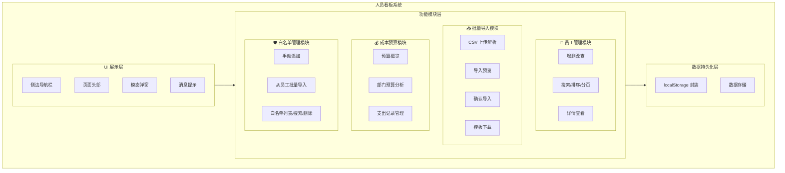

**模块清单**

| 模块 | 职责 | 依赖 |
|------|------|------|
| 员工管理模块 | 员工信息增删改查、搜索、排序、分页、详情查看 | Storage 模块 |
| 批量导入模块 | CSV 文件上传、解析、预览、确认导入、模板下载 | 员工管理模块、Storage 模块 |
| 成本预算模块 | 预算概览、部门预算分析、支出记录增删 | 员工管理模块、Storage 模块 |
| 白名单管理模块 | 白名单增删、搜索、从员工批量导入 | 员工管理模块、Storage 模块 |
| Storage 模块 | localStorage 封装、数据 CRUD、ID 生成 | 无 |

### 应用集成架构

本系统为纯前端应用，无外部系统集成。架构简化为浏览器端运行形态：

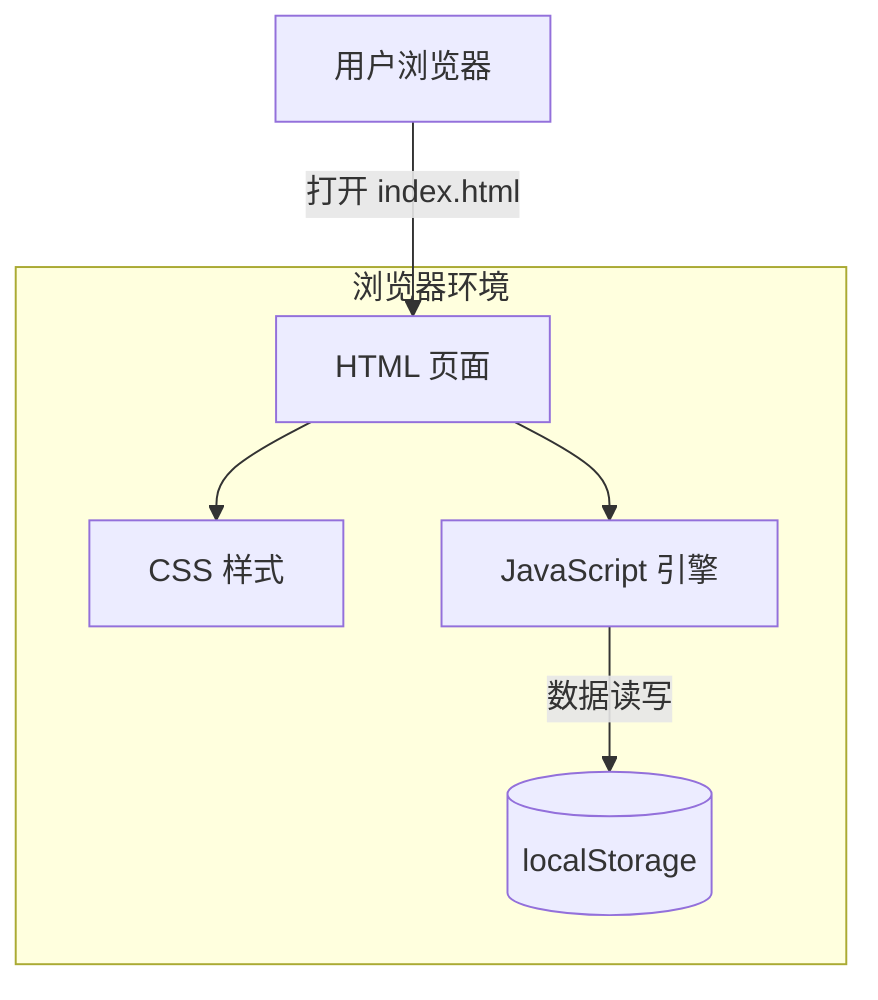

**集成关系说明：** 本系统无外部系统集成，所有功能在浏览器端独立运行。

### 部署架构

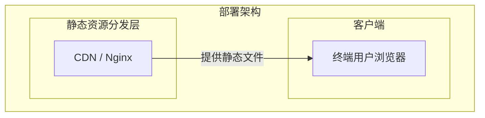

**部署说明：**
- **静态资源分发层**：通过 Nginx 或 CDN 分发 index.html、CSS、JS 等静态文件
- **客户端**：用户在浏览器中打开页面，所有数据存储在浏览器 localStorage 中
- 无需应用服务器、数据库等后端基础设施

## 3. 数据模型与存储

### 实体清单

| 实体名称 | 实体说明 | 所属模块 | 与其他实体的关系 |
|----------|----------|----------|-----------------|
| Employee | 员工基本信息 | 员工管理模块 | 被 BudgetRecord 引用；被 WhitelistEntry 引用 |
| BudgetRecord | 支出记录 | 成本预算模块 | 引用 Employee（员工） |
| WhitelistEntry | 白名单条目 | 白名单管理模块 | 引用 Employee（员工） |

### 实体关系图

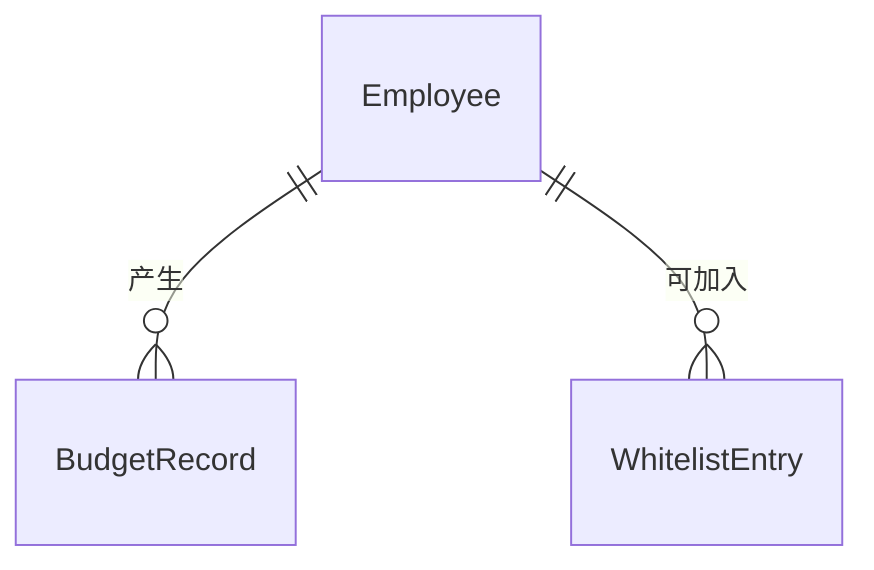

**模型说明：**
- **Employee**（员工）：系统核心实体，包含员工的基本信息（姓名、工号、部门、职位、联系方式）和成本预算金额。
- **BudgetRecord**（支出记录）：记录针对某员工或部门的支出明细，关联到员工（非强制），用于成本核算。
- **WhitelistEntry**（白名单条目）：记录允许访问系统的员工白名单，通过工号关联到员工列表。

### 存储方案
- 所有数据存储于浏览器 localStorage，以 `pd_` 为前缀的键名存储
- 存储键名：
  - `pd_employees` → Employee 列表（JSON 数组）
  - `pd_budgetRecords` → BudgetRecord 列表（JSON 数组）
  - `pd_whitelist` → WhitelistEntry 列表（JSON 数组）
- 无缓存、无消息队列需求

## 4. 接口设计

本系统为纯前端 SPA 应用，无后端 API 服务。所有"接口"以 JavaScript 模块对象方法的形式暴露。

### 4.1 前端模块接口（模块间调用）

#### 员工管理模块（EmployeeModule）

| 编号 | 接口名称 | 方法签名 | 说明 |
|------|----------|----------|------|
| M01 | 获取员工列表 | `getList()` → Array | 返回所有员工数组 |
| M02 | 新增员工 | `add(employee)` → Object | 添加员工，返回含 ID 的员工对象 |
| M03 | 更新员工 | `update(id, data)` → Object/null | 更新员工信息，返回更新后对象或 null |
| M04 | 删除员工 | `remove(id)` → void | 根据 ID 删除员工 |
| M05 | 根据 ID 获取 | `getById(id)` → Object/null | 查询单个员工 |
| M06 | 搜索员工 | `search(keyword)` → Array | 按关键字搜索员工 |
| M07 | 分页查询 | `getPagedData(page, keyword, sortField, sortOrder)` → Object | 返回分页后的员工列表及分页信息 |

#### 批量导入模块（ImportModule）

| 编号 | 接口名称 | 方法签名 | 说明 |
|------|----------|----------|------|
| M08 | 渲染导入页面 | `render(container)` → void | 渲染批量导入 UI |
| M09 | 解析 CSV | `_parseCSV(text)` → {data, errors} | 解析 CSV 文本为结构化数据 |
| M10 | 确认导入 | `_confirmImport()` → void | 将预览数据写入员工列表 |

#### 成本预算模块（BudgetModule）

| 编号 | 接口名称 | 方法签名 | 说明 |
|------|----------|----------|------|
| M11 | 获取支出记录 | `getRecords()` → Array | 返回所有支出记录 |
| M12 | 新增支出记录 | `addRecord(record)` → void | 添加支出记录 |
| M13 | 删除支出记录 | `removeRecord(id)` → void | 删除指定支出记录 |
| M14 | 获取预算汇总 | `getSummary()` → Object | 返回预算总额、已支出、剩余及部门维度数据 |

#### 白名单管理模块（WhitelistModule）

| 编号 | 接口名称 | 方法签名 | 说明 |
|------|----------|----------|------|
| M15 | 获取白名单列表 | `getList()` → Array | 返回所有白名单条目 |
| M16 | 添加白名单 | `add(entry)` → boolean | 添加白名单条目，已存在返回 false |
| M17 | 移除白名单 | `remove(id)` → void | 移除白名单条目 |
| M18 | 检查是否在白名单 | `isWhitelisted(employeeId)` → boolean | 检查工号是否在白名单中 |
| M19 | 从员工批量导入 | `batchImportFromEmployees(employeeIds)` → {added, skipped} | 从员工列表批量导入白名单 |

#### Storage 模块（Storage）

| 编号 | 接口名称 | 方法签名 | 说明 |
|------|----------|----------|------|
| M20 | 获取数据 | `get(key)` → any | 从 localStorage 读取数据 |
| M21 | 保存数据 | `set(key, value)` → boolean | 写入 localStorage |
| M22 | 删除数据 | `remove(key)` → void | 从 localStorage 删除 |
| M23 | 获取列表 | `getList(listKey)` → Array | 获取集合列表 |
| M24 | 保存列表 | `setList(listKey, list)` → boolean | 保存集合列表 |
| M25 | 生成 ID | `generateId()` → string | 生成唯一 ID |

#### 主模块（App）

| 编号 | 接口名称 | 方法签名 | 说明 |
|------|----------|----------|------|
| M26 | 初始化 | `init()` → void | 应用初始化 |
| M27 | 导航 | `navigate(page)` → void | 页面切换 |
| M28 | 注册页面模块 | `registerPage(name, module)` → void | 注册页面模块 |
| M29 | 显示消息 | `showToast(message, type)` → void | 显示提示消息 |

### 4.2 外部接口

本系统无外部 API 接口，对外集成为零。

### 4.3 内部接口

本系统为纯前端应用，无传统 Service 层，模块间通过全局对象方法直接调用。

## 5. 功能模块设计

### 5.1 员工管理模块

#### 5.1.1 表结构设计

##### 5.1.1.1 Employee（员工表）

存储于 localStorage 键 `pd_employees`，数据结构为 JSON 对象数组。

| 字段名 | 数据类型 | 约束 | 默认值 | 说明 |
|--------|----------|------|--------|------|
| id | string | PK, 唯一 | 自动生成 | 系统唯一标识，由 Storage.generateId() 生成 |
| employeeId | string | - | '' | 工号（业务标识），可空但建议唯一 |
| name | string | NOT NULL | - | 姓名 |
| department | string | - | '' | 部门 |
| position | string | - | '' | 职位 |
| phone | string | - | '' | 手机 |
| email | string | - | '' | 邮箱 |
| budget | number | - | 0 | 成本预算金额 |
| notes | string | - | '' | 备注 |
| createdAt | string | NOT NULL | ISO 时间戳 | 创建时间 |
| updatedAt | string | NOT NULL | ISO 时间戳 | 更新时间 |

**索引：** 无，localStorage 为线性遍历查询。

##### 5.1.1.2 枚举与常量定义

本模块无枚举字段。

#### 5.1.2 接口详细设计

##### M01 获取员工列表

- **方法**: `EmployeeModule.getList()`
- **描述**: 从 localStorage 获取所有员工数据
- **入参**: 无
- **出参**: Array（员工对象数组），空数组表示无数据
- **业务规则**: 直接返回 Storage 中存储的原始列表

##### M02 新增员工

- **方法**: `EmployeeModule.add(employee)`
- **描述**: 添加新员工，自动生成 ID 和时间戳
- **入参**: `{ employeeId, name, department, position, phone, email, budget, notes }`
- **出参**: Object（含 id/createdAt/updatedAt 的完整员工对象）
- **业务规则**: budget 默认为 0

##### M03 更新员工

- **方法**: `EmployeeModule.update(id, data)`
- **描述**: 根据 ID 更新员工信息，自动更新 updatedAt 时间戳
- **入参**: `id`（string），`data`（Object，包含更新字段）
- **出参**: Object（更新后的员工对象）或 null（未找到）

##### M04 删除员工

- **方法**: `EmployeeModule.remove(id)`
- **描述**: 根据 ID 删除员工
- **入参**: `id`（string）
- **出参**: void

##### M05 根据 ID 获取

- **方法**: `EmployeeModule.getById(id)`
- **描述**: 查询单个员工
- **入参**: `id`（string）
- **出参**: Object 或 null

##### M06 搜索员工

- **方法**: `EmployeeModule.search(keyword)`
- **描述**: 按姓名/部门/职位/工号/电话搜索
- **入参**: `keyword`（string）
- **出参**: Array（匹配的员工列表）

##### M07 分页查询

- **方法**: `EmployeeModule.getPagedData(page, keyword, sortField, sortOrder)`
- **描述**: 分页 + 搜索 + 排序联合查询
- **入参**: `page`: number（页码）, `keyword`: string（可选）, `sortField`: string（可选）, `sortOrder`: string('asc'|'desc')
- **出参**: `{ list, total, totalPages, page, pageSize }`

#### 5.1.3 子功能详细设计

##### 5.1.3.1 员工新增（F01）

**处理时序图：**
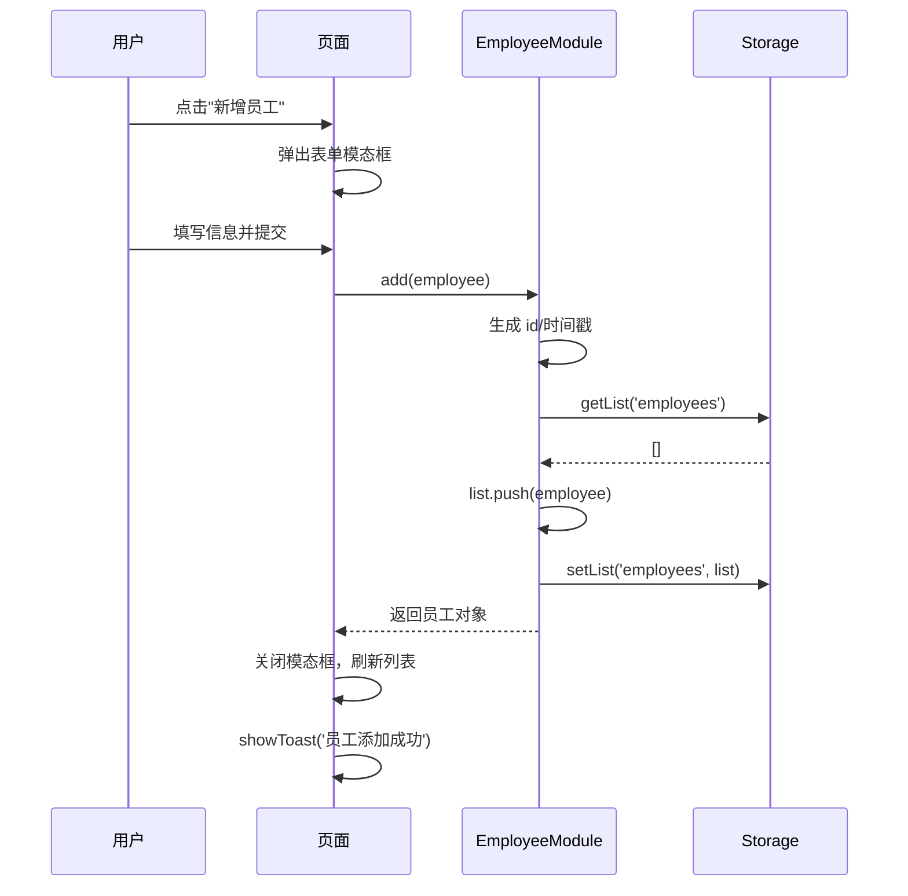

**业务规则：**
| 规则编号 | 规则描述 | 校验时机 | 不满足时的处理 |
|----------|----------|----------|--------------|
| EMP_R01 | 姓名必填 | 提交时 | 浏览器 HTML5 required 校验 |
| EMP_R02 | 工号在编辑时只读 | 编辑时 | 工号输入框设置为 readonly |

**异常场景：**
| 异常场景 | 处理方式 |
|----------|----------|
| localStorage 已满 | Storage.set 返回 false，但当前未做容量检查 |
| 工号重复 | 允许重复，不做检查 |

**并发控制：** 单浏览器串行操作，无并发风险。

##### 5.1.3.2 员工查询（F02/F05/F06）

**处理时序图：**
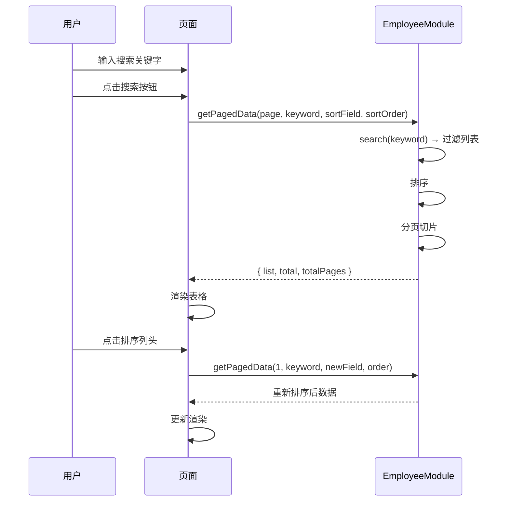

**业务规则：**
| 规则编号 | 规则描述 | 校验时机 | 不满足时的处理 |
|----------|----------|----------|--------------|
| EMP_R03 | 搜索为模糊匹配 | 搜索时 | 无匹配结果时显示空状态占位 |
| EMP_R04 | 分页 pageSize 固定 10 条 | 分页时 | 最后一页不足 10 条按实际显示 |

##### 5.1.3.3 员工修改（F03）

**流程：** 点击"编辑"→ 弹出表单（预填数据）→ 修改 → 提交 → `update(id, data)` → 刷新列表。

##### 5.1.3.4 员工删除（F04）

**流程：** 点击"删除"→ 确认弹窗 → 确认 → `remove(id)` → 刷新列表。

##### 5.1.3.5 员工详情查看（F07）

**流程：** 点击"查看"→ `getById(id)` → 弹出详情模态框展示完整信息。

### 5.2 批量导入模块

#### 5.2.1 表结构设计

本模块无独立表结构，数据最终写入 Employee 表（见 5.1.1.1）。

**枚举与常量定义：**

| 枚举名称 | 取值 | 含义 | 关联字段 |
|----------|------|------|----------|
| 导入列顺序 | 姓名,工号,部门,职位,手机,邮箱,预算,备注 | CSV 列顺序定义 | 导入解析 |

#### 5.2.2 接口详细设计

##### M08 渲染导入页面

- **方法**: `ImportModule.render(container)`
- **描述**: 渲染批量导入 UI，包含文件上传区、预览区、模板下载区
- **入参**: `container`（DOM 元素）
- **出参**: void

##### M09 解析 CSV

- **方法**: `ImportModule._parseCSV(text)`
- **描述**: 解析 CSV 文本，每行按逗号分隔，支持引号内逗号
- **入参**: `text`（string，CSV 原始文本）
- **出参**: `{ data: Array, errors: Array }`
  - data: `[{ name, employeeId, department, position, phone, email, budget, notes }]`
  - errors: `[{ line: number, message: string }]`

##### M10 确认导入

- **方法**: `ImportModule._confirmImport()`
- **描述**: 将解析后的数据批量写入员工列表，工号已存在则跳过
- **入参**: 无（使用内部 `_importedData`）
- **出参**: void（通过 Toast 显示导入结果）
- **业务规则**: 工号相同的员工自动跳过（去重），姓名为空的记录跳过并记录错误

#### 5.2.3 子功能详细设计

##### 5.2.3.1 CSV 文件上传与解析（F08）

**处理时序图：**
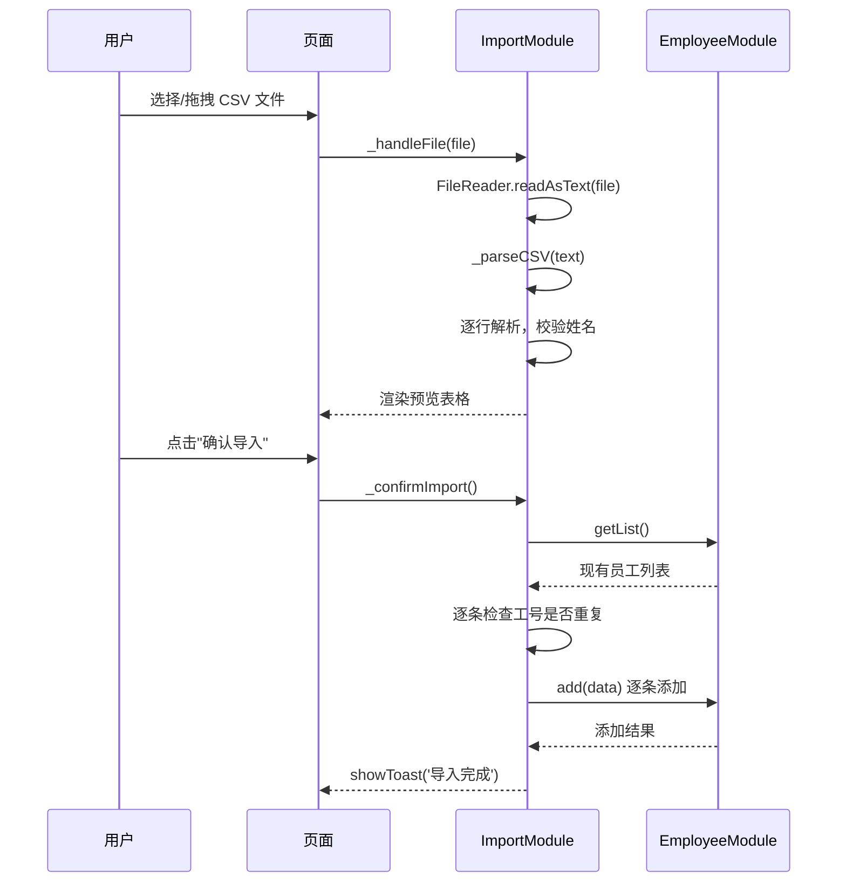

**业务规则：**
| 规则编号 | 规则描述 | 校验时机 | 不满足时的处理 |
|----------|----------|----------|--------------|
| IMP_R01 | 仅支持 CSV/TXT 格式 | 文件选择时 | 提示"请上传 CSV 格式文件" |
| IMP_R02 | 姓名为空的行跳过 | 解析时 | 记录错误信息，不中断 |
| IMP_R03 | 工号已存在时跳过 | 导入时 | 记录跳过数量，不中断 |
| IMP_R04 | 默认 UTF-8 编码 | 读取时 | 使用 FileReader 默认 UTF-8 |

**异常场景：**
| 异常场景 | 处理方式 |
|----------|----------|
| 文件读取失败 | 显示"文件读取失败"错误提示 |
| 空文件或无效内容 | 显示"无有效数据可导入" |
| CSV 格式异常（如列数不匹配） | 空字段补空字符串，不中断 |

**并发控制：** 单浏览器串行操作，无并发风险。

##### 5.2.3.2 模板下载（F09）

**流程：** 点击"下载模板"→ 生成带 BOM 的 CSV 字符串 → 创建 Blob → 触发下载 → 提示"模板已下载"。

**模板格式：** `姓名,工号,部门,职位,手机,邮箱,预算,备注`

### 5.3 成本预算模块

#### 5.3.1 表结构设计

##### 5.3.1.1 BudgetRecord（支出记录表）

存储于 localStorage 键 `pd_budgetRecords`，数据结构为 JSON 对象数组。

| 字段名 | 数据类型 | 约束 | 默认值 | 说明 |
|--------|----------|------|--------|------|
| id | string | PK, 唯一 | 自动生成 | 系统唯一标识 |
| employeeId | string | - | '' | 关联员工 ID |
| employeeName | string | - | '' | 员工姓名（冗余，便于展示） |
| department | string | - | '' | 部门（冗余，从员工自动填充） |
| amount | number | NOT NULL | - | 支出金额 |
| project | string | - | '' | 项目/用途 |
| notes | string | - | '' | 备注 |
| createdAt | string | NOT NULL | ISO 时间戳 | 创建时间 |

##### 5.3.1.2 枚举与常量定义

本模块无枚举字段。

#### 5.3.2 接口详细设计

##### M11 获取支出记录

- **方法**: `BudgetModule.getRecords()`
- **描述**: 从 localStorage 获取所有支出记录
- **入参**: 无
- **出参**: Array

##### M12 新增支出记录

- **方法**: `BudgetModule.addRecord(record)`
- **描述**: 添加支出记录，自动生成 ID 和时间戳
- **入参**: `{ employeeId, amount, project, notes }`
- **出参**: void

##### M13 删除支出记录

- **方法**: `BudgetModule.removeRecord(id)`
- **描述**: 删除指定支出记录
- **入参**: `id`（string）
- **出参**: void

##### M14 获取预算汇总

- **方法**: `BudgetModule.getSummary()`
- **描述**: 计算预算总额、已支出、剩余及部门维度数据
- **入参**: 无
- **出参**: `{ totalBudget, totalSpent, remaining, deptBudget, deptSpent }`

#### 5.3.3 子功能详细设计

##### 5.3.3.1 成本预算概览（F11/F12）

**处理时序图：**
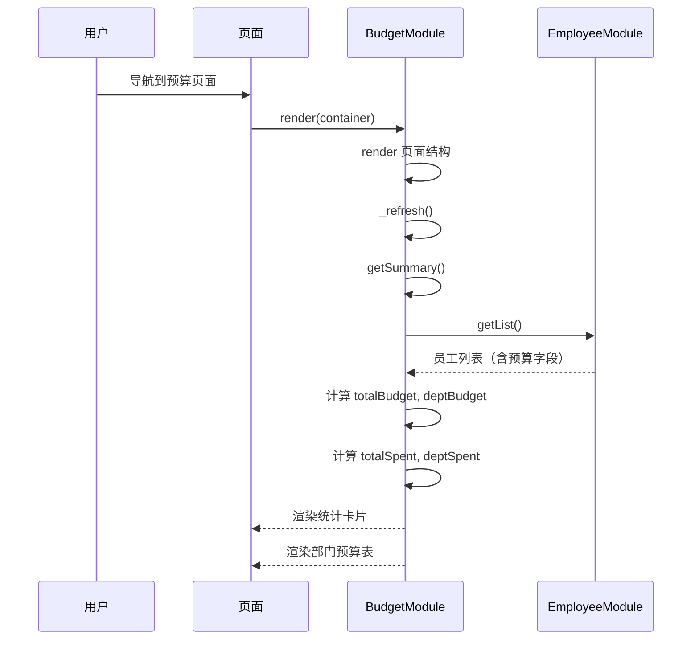

**业务规则：**
| 规则编号 | 规则描述 | 校验时机 | 不满足时的处理 |
|----------|----------|----------|--------------|
| BUD_R01 | 预算总额 = 所有员工预算之和 | 渲染时 | 无数据时显示 0 |
| BUD_R02 | 已支出 = 所有支出记录金额之和 | 渲染时 | 无数据时显示 0 |
| BUD_R03 | 剩余 = 预算总额 - 已支出 | 渲染时 | 剩余为负时标红显示 |
| BUD_R04 | 部门预算按员工所属部门汇总 | 渲染时 | 未分配部门归入"未分配" |

##### 5.3.3.2 支出记录管理（F13）

**处理时序图：**
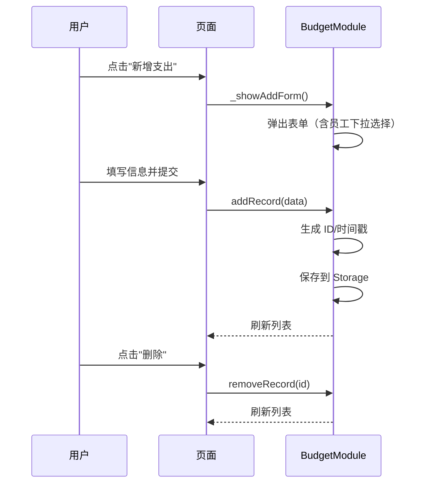

**业务规则：**
| 规则编号 | 规则描述 | 校验时机 | 不满足时的处理 |
|----------|----------|----------|--------------|
| BUD_R05 | 金额必须大于 0 | 提交时 | 提示"请输入有效金额" |
| BUD_R06 | 选择员工后自动填充姓名和部门 | 选择时 | 从 Employee 列表匹配 |

**异常场景：**
| 异常场景 | 处理方式 |
|----------|----------|
| 无员工时新增支出 | 员工下拉列表为空，可选择无关联员工 |
| 金额为负数或零 | 前端校验拦截，提示错误 |

**并发控制：** 单浏览器串行操作，无并发风险。

### 5.4 白名单管理模块

#### 5.4.1 表结构设计

##### 5.4.1.1 WhitelistEntry（白名单条目表）

存储于 localStorage 键 `pd_whitelist`，数据结构为 JSON 对象数组。

| 字段名 | 数据类型 | 约束 | 默认值 | 说明 |
|--------|----------|------|--------|------|
| id | string | PK, 唯一 | 自动生成 | 系统唯一标识 |
| employeeId | string | 业务唯一 | - | 工号（白名单去重依据） |
| name | string | NOT NULL | - | 姓名 |
| department | string | - | '' | 部门 |
| createdAt | string | NOT NULL | ISO 时间戳 | 创建时间 |

##### 5.4.1.2 枚举与常量定义

本模块无枚举字段。

#### 5.4.2 接口详细设计

##### M15 获取白名单列表

- **方法**: `WhitelistModule.getList()`
- **描述**: 获取所有白名单条目
- **入参**: 无
- **出参**: Array

##### M16 添加白名单

- **方法**: `WhitelistModule.add(entry)`
- **描述**: 添加白名单条目，工号已存在时返回 false
- **入参**: `{ employeeId, name, department }`
- **出参**: boolean（true=添加成功，false=已存在）
- **业务规则**: 同一工号不可重复添加

##### M17 移除白名单

- **方法**: `WhitelistModule.remove(id)`
- **描述**: 根据 ID 移除白名单条目
- **入参**: `id`（string）
- **出参**: void

##### M18 检查是否在白名单

- **方法**: `WhitelistModule.isWhitelisted(employeeId)`
- **描述**: 检查工号是否在白名单中
- **入参**: `employeeId`（string）
- **出参**: boolean

##### M19 从员工批量导入

- **方法**: `WhitelistModule.batchImportFromEmployees(employeeIds)`
- **描述**: 从员工列表批量导入到白名单
- **入参**: `employeeIds`（Array，员工 ID 列表）
- **出参**: `{ added: number, skipped: number }`

#### 5.4.3 子功能详细设计

##### 5.4.3.1 白名单手动添加（F14）

**处理时序图：**
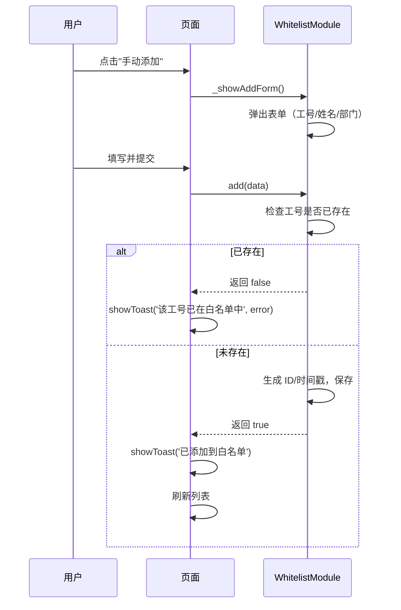

**业务规则：**
| 规则编号 | 规则描述 | 校验时机 | 不满足时的处理 |
|----------|----------|----------|--------------|
| WL_R01 | 工号必填 | 提交时 | HTML5 required 校验 |
| WL_R02 | 姓名必填 | 提交时 | HTML5 required 校验 |
| WL_R03 | 工号不可重复 | 添加时 | 提示"该工号已在白名单中" |

##### 5.4.3.2 白名单批量导入（F15）

**处理时序图：**
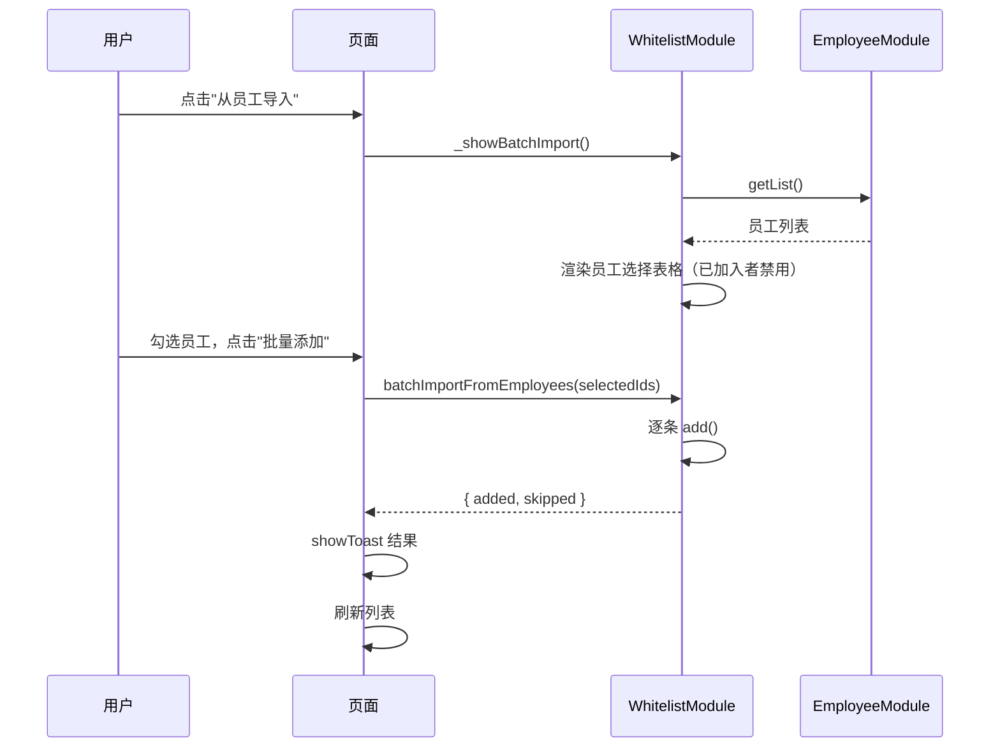

**业务规则：**
| 规则编号 | 规则描述 | 校验时机 | 不满足时的处理 |
|----------|----------|----------|--------------|
| WL_R04 | 已存在于白名单的员工自动禁用 | 渲染时 | 复选框 disabled，显示"已添加" |
| WL_R05 | 至少选择一名员工 | 提交时 | 提示"请选择要添加的员工" |

##### 5.4.3.3 白名单列表/搜索/删除（F16/F17）

**流程：** 搜索框输入 → 按姓名/工号/部门过滤 → 分页展示 → 点击"移除"→ 确认 → `remove(id)` → 刷新列表。

**统计数据：** 白名单人数 + 覆盖率（白名单人数/员工总数 × 100%）。

## 6. 非功能性需求设计

### 6.1 高可用性
本系统为纯前端应用，无服务端依赖，可用性由浏览器环境和静态资源托管服务保障。
- **静态资源**：通过 CDN 或 Nginx 分发，多副本冗余，无单点
- **客户端**：所有数据存储在浏览器 localStorage，离线状态下仍可读取已有数据（但无法加载新页面资源）
- **降级策略**：如 localStorage 不可用（隐私模式限制等），Storage 模块通过 try-catch 捕获异常，返回 null，页面功能降级为只读

### 6.2 可扩展性
- **水平扩展**：静态资源可通过 CDN 多节点分发，天然水平扩展
- **功能扩展**：基于模块化架构（App.registerPage），新增页面只需添加新模块文件并注册，不影响现有模块
- **数据扩展**：localStorage 容量约 5-10MB，适合中小团队（<1000 人）；超出时需迁移至 IndexedDB 或后端存储

### 6.3 稳定性/可靠性
- **边界处理**：搜索无结果时显示空状态占位，不崩溃
- **数据完整性**：所有数据操作通过 try-catch 包裹，异常时不中断整体流程
- **CSV 解析**：支持引号内逗号、空行跳过、列数不足补空，提升容错性

### 6.4 安全性设计

#### 6.4.1 账户系统方案
**本项不适用**，原因：本系统为纯前端单机应用，无用户认证需求。

#### 6.4.2 授权与访问控制
**本项不适用**，原因：系统无多用户场景，所有数据存储在本地浏览器，无远程访问控制需求。

#### 6.4.3 数据防护方案

##### 6.4.3.1 是否对敏感数据加密存储
- 当前未对 localStorage 数据进行加密
- **假设**：数据仅存储在用户本地浏览器中，不传输至网络，默认可信环境
- **建议**：如需存储身份证号、银行卡等敏感信息，应增加 AES 加密

##### 6.4.3.2 是否对敏感数据展示进行脱敏
- 当前未做脱敏处理
- **建议**：手机号可部分脱敏展示（如 138****0000），邮箱可部分脱敏（如 z***@example.com）

### 6.5 监控/统计/日志/告警
**本项不适用**，原因：纯前端应用无服务端监控需求。前端异常可通过浏览器开发者工具 Console 查看。

## 7. 变更三板斧

### 7.1 可监控
**本项不适用**，原因：纯前端应用无服务端埋点需求。前端功能可通过浏览器 DevTools 监控。

### 7.2 可灰度
**本项不适用**，原因：纯前端单机应用，无服务端灰度发布能力。功能迭代通过版本更新发布静态资源实现。

### 7.3 可应急
**本项不适用**，原因：纯前端应用无服务端变更风险。功能问题可通过回滚静态资源版本解决。用户数据存储在浏览器 localStorage，应用版本变更不影响已有数据。